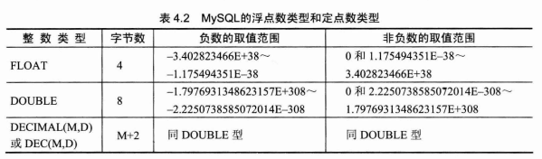
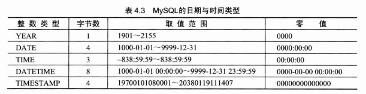
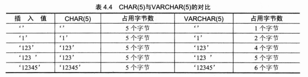
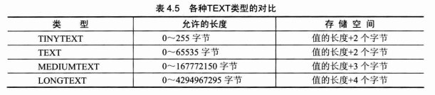
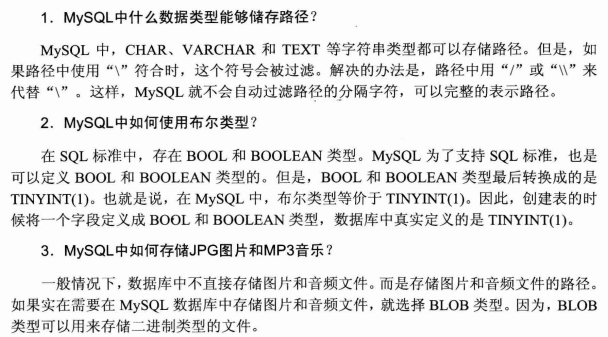
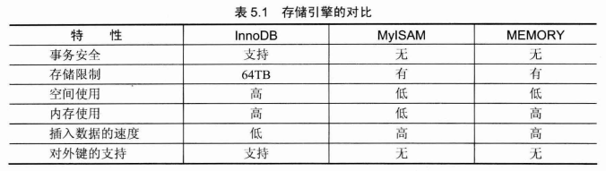
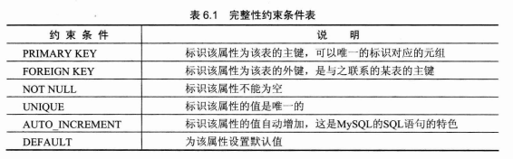

###1-3章不做描述
#MySql数据类型
##MySql数据类型介绍
###整数类型


- 每个整数类型都有默认的显示宽度
	- 如果设置了宽度，但是最后插入的值大了，仍可以显示，只要小于默认即可
###浮点数类型和定点数类型


- MySql可以指定浮点数和定点数的精度
	- 格式：数据类型（M，D）
###日期与时间类型

###字符串类型
- char类型和varchar类型

- TEXT类型

- ENUM类型
	- 在创建表时，enum类型的取值范围就以列表的形式指定了
- SET类型
- 二进制类型
- BLOB类型
##常见问题和解答

#操作数据库
##创建数据库
``create database example;``
``show databases;`` 
##删除数据库
``drop database example;``
##数据库存储引擎
<p>存储引擎的概念时MySql的提点，而且时一种嵌入式存储引擎的概念，这决定了MySql数据库中的表可以用不同的方式存储，用户可以根据自己的不同要求，选择不同的存储方式，是否进行事务处理等
###MySQL存储引擎简介
``show engines;``
- 修改默认存储引擎
``default-storage-engine=INNODB``
###InnoDB存储引擎
- 给MySQL提供了事务，回滚，崩溃修复能力和多版本并发控制的事务安全，是一个提供外键约束的表引擎，其处理事务的能力也是超级棒的
- InnoDB存储引擎值中支持自动增长列，且增长列的值不能为空且唯一，自增列必须为主键
- 支持外键。外键所在的表为子表，外键所依赖的表为父表，父表中被子表关联的字段必须为主键
- 创建的表的表结构存储在.fm文件中。数据和索引存储在Innodb_data_home_dir和innodb_data_file_path定义的表空间中。、
- 优缺点：
	- 优：良好的事务管理，崩溃修复恩嗯例和并发控制。
	- 缺：读写效率稍差，占用的数据空间相对比较大
###MyISAM存储引擎
- 曾经时默认存储引擎
- 优点：占用空间小，处理快
- 缺点：不支持事务的完整性和并发性
###MEMORY存储引擎
- 表实际对应一个磁盘文件。默认使用哈希索引。其速度要比使用b树索引快
- 表的处理速度非常快
- 数据易丢失，生命周期短。

# 第六章：创建，修改和删除表
##创建表
###创建表语法形式
```
create table exp(id int,
				name varchar(20),
				sex boolean
				);
```
- 完整性约束条件表

###设置表的主键
- 目的：帮助MySQL以最快的速度查找到表中的某一条信息
- 满足的条件：唯一性，非空值
- 单字段主键 :
```
create table exp(stu_id int primary key,
				stu_name varchar(20)
				);
```
- 多主键
```
create table exp2(
		stu_id int,
		course_id int,
		grade float,
		primary key(stu_id,course_id)
		);
```
###设置表的外键
```
 create table exp3(
 				id int primary key,
 				stu_id int,course_id int,
 				constraint c_fk foreign key(stu_id,course_id)
 				references exp2(stu_id,course_id)
 				);
```
###设置表的非空约束
```
 create table exp4(
 				id int not null  primary key,
 				name varchar(20) not null,
 				stu_id int,
 				constraint d_fk foreign key(stu_id)
 				references exp1(stu_id)
 				);

```
###设置表的唯一性约束
```
 create table exp6(
 				id int primary key,
 				stu_id int unique,
 				 name varchar(20) not null
 				 );

```
###设置表的属性值自动增加
```
 create table exp7(
 				id int primary key auto_increment,
 				stu_id int unique,
 				 name varchar(20) not null
 				 );
```
###设置表的属性的默认值
```
 create table exp8(
 				id int primary key auto_increment,
 				stu_id int unique,
 				 name varchar(20) not null
create table exp8(id int primary key auto_increment,
				stu_id int unique,
				 name varchar(20) not null,
				 English varchar(20) not null default 'zero',
				 Math float default 0,
				 computer  float default 0
				 );
```
###查看表结构语句describe
`` describe exp;``
或``desc``
###查看表详细结构语句
```
show create table exp1;
```
##修改表
###修改表名
```
alter table ex rename exp;
```
###修改字段的数据类型
```
alter table tablename modify attributename int;
```
###修改ziiduan名
```
alter table tablename change oldattri newattri newtype;

```
