#第10章：查询语句
##基本查询语句
```
SELECT num,name,age FROM emp;
SELECT num,address FROM emp WHERE age>23 ORDER BY d_id DESC;
//ORDER BY 表示排序方式 默认ASC 升序
```
##单表查询
###查询所有字段
```
SELECT num,id address,age FROM emp;
SELECT * FROM emp;
```
###查询指定字段
```
SELECT num FROM emp;
```
###查询指定记录
```
SELECT * FROM exp WHERE d_id=100;
```
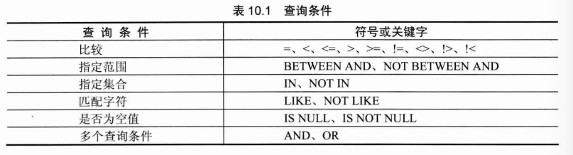
###带IN关键字的查询
```
SELECT * FROM eml WHERE d_id IN(1000,1005);
//取值为1000或者1005的记录 NOT IN 同理
```
###带BETWEEN AND 或者NOT BETWEEN AND
###带LIKE的匹配查询
```
SELECT * FROM emp WHERE name LIKE 'SD';
//这里like等于=
SELECT * FROM emp WHERE name LIKE 'beijing%'
//beijing后边随便写，使用了通配符 like不等于=
SELECT * FROM exp WHERE name LIKE 'beijing_'
//beijing后边只能一个符
//一个汉字要两个_ _
```
###查询空值
```
SELECT * FROM work WHERE info IS (NOT) NULL;
```
###带AND的多条件查询（用来联合多个条件进行查询）
```
SELECT * FROM emp WHERE age<14 AND name='sd' AND id=2;
```
###带OR的多条件查询
```
SELECT * FROM emp WHERE age<14 OR name='sd' OR id=2;
```
###OR和AND可以同时用，但是AND运算优先
###查询结果不重复
```
SELECT DISTINCT d_id FROM emp;
```
### 对查询结果排序
```
SELECT * FROM emp ORDER BY age DESC,id ASC;
```
###分组查询
- 将查询结果按照某个字段或多个字段进行分组
- 一般和函数一起用GROUP BY，因为GROUP BY单独使用时只能查询分组的一条记录
```
SELECT * FROM sex,GROP_CONCAT(name) FROM employee GROUP BY sex;
SELECT sex ,COUNT(sex) FROM employee GROUP BY sex;
```
- 和HAVING一起用
```
SELEXT sex COUNT(sex) FROM emp GROUP BY sex HAVING COUNT(sex)>=3;
```
- 按多个字段进行分组
```
SELECT * FROM emp GROUP BY d_id ,sex;
//先按d_id,再按sex
```
- 和WITH ROLLUP 一起用，最后加上一条新纪录，计算总和
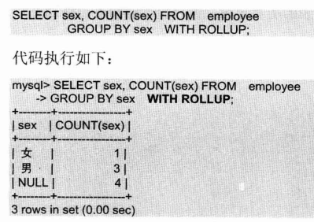
###用LIMIT限制查询结果的数量
- 不指定初始位置
```
SELECT * FROM emp LIMIT 2;
//只显示前两条
```
- 指定初始位置
```
SELECT * FROM emp LIMIT 0,2;
//第一个位置开始，显示两条
```
## 使用集合函数查询
```
SELECT COUNT(*) FROM emp;
SELECT d_id ,COUNT(*) FROM emp GROUP BY d_id;
SELECT num,SUM(score) FROM grade WHERE num=1001;
SELECT AVG(age) FROM emp;
SELECT AVG(score) FROM grade FROM grade GROUP BY course;
SELECT course,AVG(score) FROM grade GROUP BY course; 
SELECT MAX(age) FROM emp;
SELECT num,course,MAX(score) FROM grade GROUP BY course;
SELECT MIN(age) FROM emp;
```
##连接查询
###内连接查询
- 可以查询两个或两个以上的表，需要通过指定字段进行连接（要具有相同意义），当值相等就查出记录
```
SELECT num,name ,emp_id,d_nae FROM emp,dep WHERE emp_id=dep_id;
```
###外连接查询
- 两个或两个以上表，需要指定字段，字段相等时取记录，不等时也能查出来。外连接包括左连接和右连接
- 左连接：查出表1中的所有记录，表2的查询匹配的记录
```
SELECT num,name ,emp.d_id FROM emp LEFT JOIN dep ON emp.id = dep.d_id;
```
- 右连接：查出表2中的所有记录，表1的查询匹配记录
```
SELECT num,name ,emp.d_id FROM emp RIGHT JOIN dep ON emp.id = dep.d_id;
```
##子查询
- 内层查询的结果为外层查询语句提供查询条件
###带IN关键字的子查询
```
SELECT * FROM emp
			 WHERE d_id (NOT)IN
						(SELECT d_id FROM dep);						
```
###带比较运算符的子查询
```
SELECT id,name score FROM com_stu
							WHERE score>=
								(SELECT score FROM scholarship
								WHERE level=1);
```
###带EXISTS关键字的子查询
- 如果内层返回TRUE ，则执行外层，否则不执行
```
SELECT * FROM emp 
			WHERE EXISTS
					(SELECT d_name FROM dep
						WHERE d_id=1003);
```
- 条件表达式和EXITS关键字一起用
```
SELECT * FROM emp 
			WHERE age>20 AND EXISTS
					(SELECT d_name FROM dep
						WHERE d_id=1003);
```
###带ANY关键字的查询
```
SELECT * FROM stu WHERE score>=ANY (SELECT score FROM scholarship);
```
###带ALL关键字的子查询
```
SELECT * FROM stu WHERE score>=ALL (SELECT score FROM scholarship);
```
##合并查询结果
- UNION 和UNION ALL 的区别，前者去重后者没有
```
SELECT d_id FROM dep
UNION (ALL)
SELECT d_id FROM emp;
```
##为表和字段取别名
###表取别名
```
SELECT * FROM dep d WHERE d.d_id=1001;
```
###字段取别名
```
SELECT d_id AS dep_id,d_name AS dep_name FROM dep;
```
##使用正则表达式查询
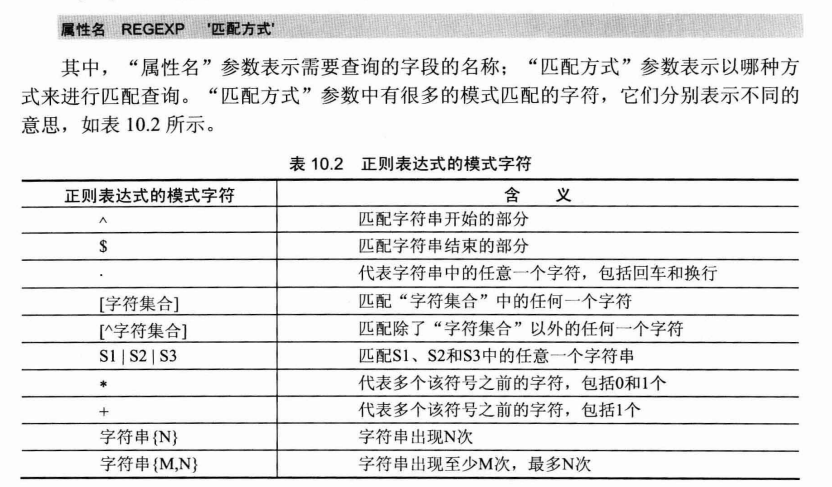
```
'^aaa'  以aaa开头
's$' 以s结束
'^L..Y$' 两个.. 代替字符串中任意字符
'[cao]' 包含cao中任意一个字母
'[0-9]' 包含0-9任意
'[^a-z0-9]' 包含这些以外的字符
'ic'包含ic
'ic|uc|us' 或者的关系
'a+c' 中间至少一个字符
'a*c' 中间可以0个
'a{3}'出现过3次
'a{1,3}' 至少1次，之多3次
```
##问题
- 集合函数一般和GROUP BY用，除非如计算索引学生的平均分等
- 取别名主要可以简短和明确字段
- 使用通配符和正则表达式都可以模糊查询，不过正则更灵活
#第11章：插入，查询与删除数据
##插入数据
```
INSERT INTO product VALUES(1001,'12','12');
INSERT INTO product(id,function,name) VALUES(1001,'2','2');
INSERT INTO prodict(id,fun,add) SELECT id ,fun,add FROM med;
```
##更新数据
```
UPDATE pro SET name='s',add='s' WHERE id=1001 AND ns='sd';
```
##删除数据
```
DELETE FROM pro WHERE id=100;
DELETE FROM pro;
DELETE * FROM pro;
```

#第12章：MySQL运算符
##运算符简介
- 算数运算符：加减乘除求余（模运算）
- 比较运算符
- 逻辑运算符
- 位运算符
```
SELECT a, a<>23,a!24 FROM T1;
```
# 第13章：MySQL函数
##数学函数
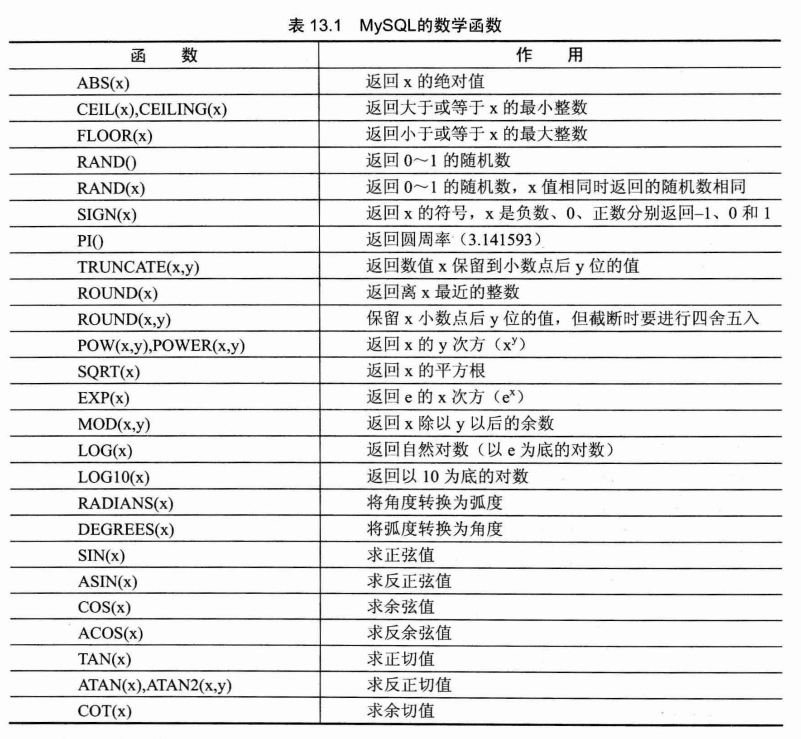
##字符串函数
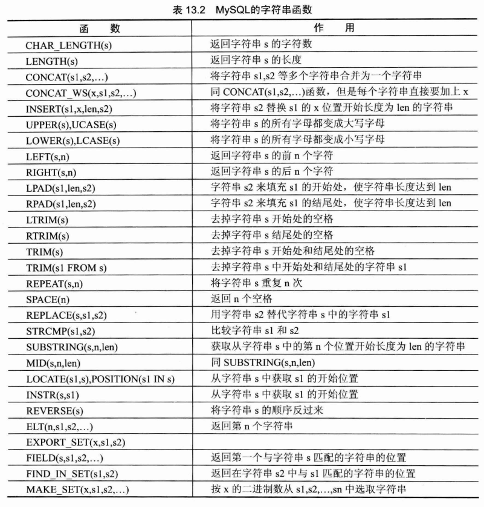
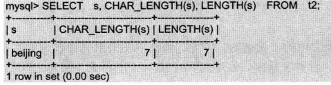
## 日期和时间函数
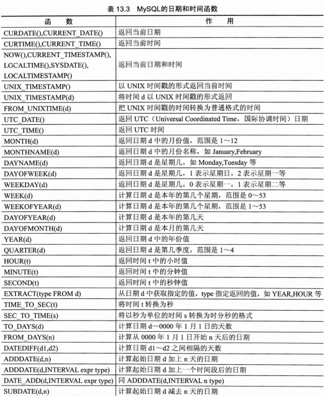
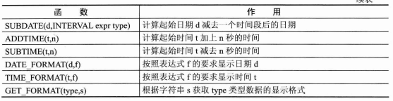
##条件判断函数
- IF(expr,v1,v2)
```
SELECT id ,grade,IF(grade>=60,'pass','fail') FROM t4;
```
- IFNULL(v1,v2)
```
SELECT id,IFNULL(grade,'NO GRADE') FROM t4;
```
- CASE
```
SELECT id,grade,CASE WHEN grade>60 THEN 'GOOD' WHEN grade=60 THEN 'pass' ELSE 'FAIL' END level FROM T4;
```
##系统信息函数
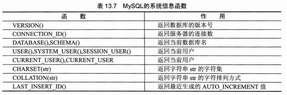
##加密函数
- PASSWORD(str):用户密码加密
- MD5(str)：普通数据加密
- ENCODE(str,pswd_str):加密结果是二进制数，必须用BLOB类型字段保存
- DECODE(crypt_str,pswd_str):encode加密的解密
##其他函数
- FORMAT(x,n):格式化函数
- 进制转换
- IP地址与数字相互转换
- 加锁和解锁的函数
- 重复执行指定操作的函数
- 改变指定字符集函数
- 改变字段数据类型的函数
#第14章：存储过程和函数
- 存储过程和函数是在数据库中定义一些SQL语句的集合，然后直接调用这些存储过程和函数来执行定义好的SQL语句，存储过程和函数可以避免开发人员重复的编写相同的SQL语句。
- 存储过程和函数是在MySQL服务器中存储和执行的，可以减少客户端和服务器端的数据传输
##创建存储过程和函数
###创建存储过程
```
CREATE PROCEDURE num_from_employee(IN emp_id,INT,OUT count_num INT)
	READS SQL DATA
	BEGIN 
		SELECT COUNT(*) INTO count_num
		FROM emp
		WHERE d_id=emp_id;
	END
```
###创建存储函数
```
CREATE FUNCTION name_from_emp(emp_id INT)
	RETURNS VARCHAR(20)
	BEGIN
		RETURN (SELECT name FROM emp WHERE num=emp_id)
	END
```
###变量的使用
- 定义变量
```
DECLARE my_sql INT DEFAULT 10;
```
- 为变量赋值
```
SET my_sql=30;
```
```
SELECT d_id INTO my_sql FROM emp WHERE id=2;
```
###定义条件和处理程序
- 是事先定义程序执行过程中可能遇到的问题，并且可以在处理程序定义解决这些问题的办法，避免程序异常
- 定义条件
```
DECLARE can_not_find CONDITION FOR SQLSTATE '42S02';
DECLARE can_not_find CONDITION FOR 1146;
```
- 定义处理程序
```
DECLARE CONTINUE HANDLER FOR SQLSTATE '426S2'  SET @info='CAN NOT FIND';
```
###光标的使用
- 声明光标
```
DECLARE our_emp CURSOR FOR SELECT name,age FROM emp;
```
- 打开光标
```
OPEN our_emp;
```
- 使用光标
```
FECTH our_emp INTO emp_name,emp_age;
```
- 关闭光标
```
CLOSE our_emp;
```
###流程控制的使用
- IF语句
```
IF age>20 THEN SET @count1=@count+1;
	ELSEIF age=20 THEN @count2=@count+1	;
	ELSE @count3=@count3+1;
END IF;
```
- CASE语句
```
CASE	
	WHEN age=20 THEN SET @count=count+1;
	ELSE SET @count2=@count2+1;
END CASE;
```
- LOOP语句
```
add_num:LOOP
	SET @count=@count+1;
END LOOP add_num;
```
- LEAVE语句
```
add_num:LOOP
	SET @count=@count+1;
	IF @count=100 THEN LEAVE add_num;
END LOOP add_num;
```
- ITERATE 语句
```
add_num:LOOP
	SET @count=@count+1;
	IF @count=100 THEN 
		LEAVE add_num;
	ELSE IF MOD(@count,3)=0 THEN
		ITERATE add_num;
	SELECT * FROM emp;
END LOOP add_numl
```
- REPEAT 语句
```
REPEAT 
	SET @count=@count+1;
	UNTIL @count=100
END REPEAT;
```
- WHILE语句
```
WHILE @count<100 DO
	SET @count=@count+1;
END WHILE;
```
##调用存储过程和函数
- 存储过程用CALL调用，存储函数和内部函数的调用一样。执行存储过程和存储函数需要拥有EXECUTE权限
###调用存储过程
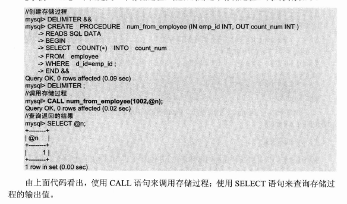
### 调用存储函数
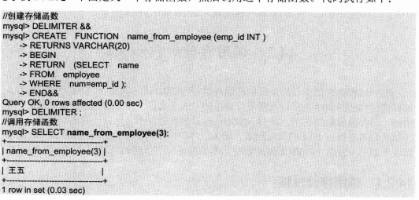
## 查看存储过程和函数
```
SHOW PROCEFURE STATUS LIKE 'num_from_emp'\G
SHOW CREATE PROCEDURE num_from_emp\G
```
## 修改存储过程和函数
```
ALTER PROCEDURE num_from_emp
	MODIFIES SQL DATA
	SQL SECURITY INVOKER;
	//修改权限为MODIFIES SQL DATA
```
##删除存储过程和函数
```
DROP PROCEDURE num_from_emp;
DROP FUNCTION name_from_emp;
```
## 问题
- 一个存储过程中可以调用其他的存储过程
- 存储过程和存储函数的区别
	- 存储过程的参数有三类，分别是IN OUT INOUT。通过OUT，INOUT 将存储过程的执行结果输出。且存储过程可以有多个OUT，INOUT类型的变量
	- 存储函数中的参数都是输入参数，函数中的运算结果通过RETURN语句返回，只能返回一个结果
	