#第 一章. Spring之旅
###1. 简化JAVA开发
####激发POJO的潜能
- 为降低Javakaifa的复杂性，Spring采取了
	- 基于POJO的轻量级和最小侵入性编程
	- 通过依赖注入和面向接口实现松耦合
	- 基于切面和惯例进行声明式编程
	- 通过切面和模板减少样板式代码
- 耦合的两面性：
	- 难以测试，难以复用，难以理解，修复一个bug又会产生新的bug
	- 完全没有耦合的代码什么也做不了
	- 耦合是必须的，但是应当被谨慎管理
####依赖注入
- 通过DI，对象的依赖关系将由系统中负责协调各对象的第三方组件在创建对象的时候进行设定。对象无需自行创建或者管理它们的依赖关系，依赖关系将被自动注入到需要它们的对象上去
	- 不使用DI
	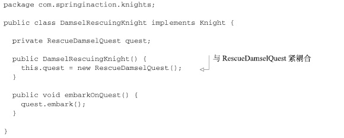
	- 使用DI（构造器注入）：对依赖进行替换的一个最常用的方法就是在测试的时候使用mock实现
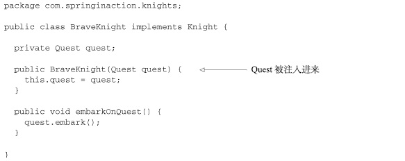
	- 测试
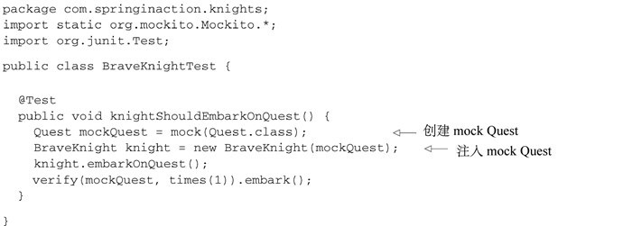
	- 创建应用组件之间的协作行为通常称为装配。有XML方式
	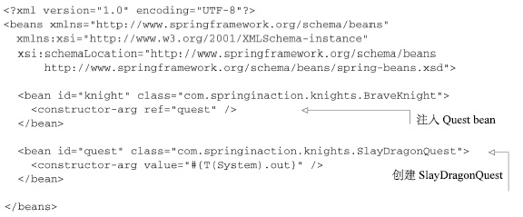
	-基于java的配置
	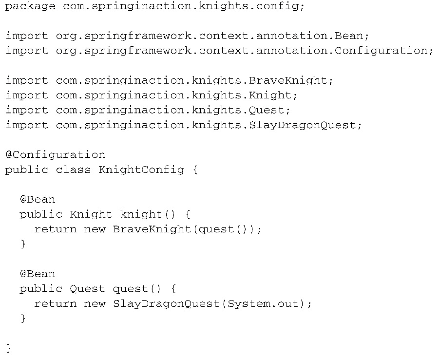
- Spring通过应用上下文（Application Context）装载bean的定义并把它们组装起来。Spring应用上下文全权负责对象的创建和组装。Spring自带了多种应用上下文的实现，它们之间的主要区别仅仅在于如何加载配置。
如knights.xml中的bean时使用XML文件进行配置的，所以选择ClassPathXmlApplication作为应用上下文相对时比较合适的
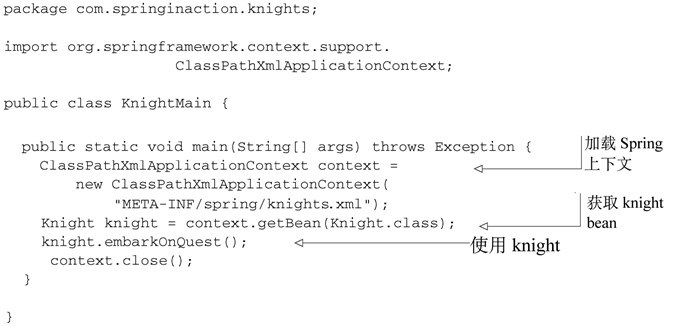
####应用切面
- DI能够让相互协作的软件组件保持松散耦合，而面向切面编程允许把遍布在各处的  功能分离出来形成可重用的组件
     紧密耦合的例子
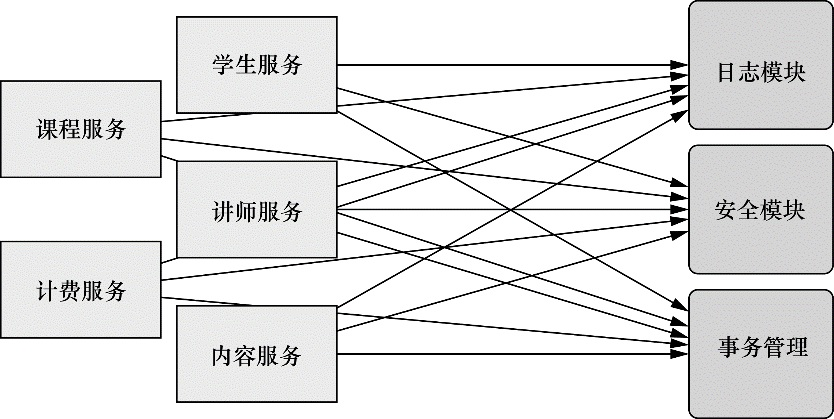
	- AOP往往被定义为促使软件系统实现关注点的分离的技术。
	- AOP使服务模块化，并以声明的方式将它们应用到影响的组件中区。结果就是这些组件会具有更高的内举行并且会更加的关注自身的业务，完全不需要了解设计系统服务所带来的复杂性。也就是AOP能确保POJO的复杂性
	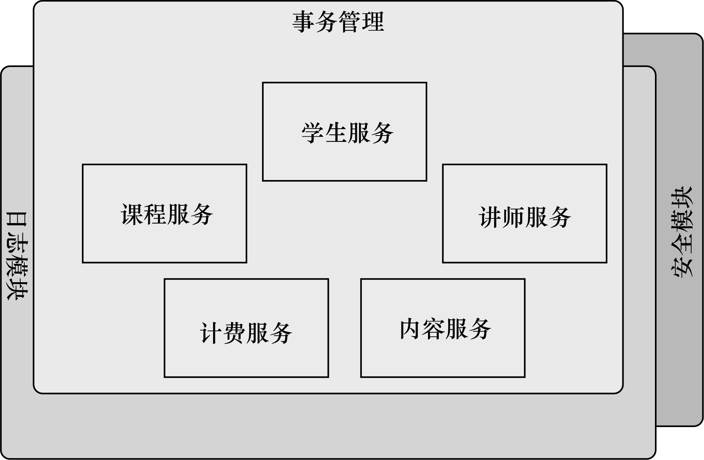
	- 可以把切面想象为覆盖在很多组件之上的一个外壳
	- 骑士的例子
	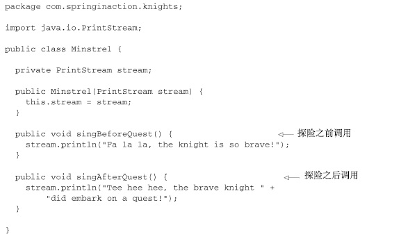
	- 定义切面
	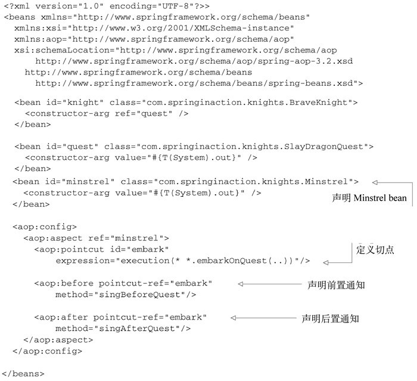
####使用模板消除样板式代码
- 在JDBC中的样板式代码的例子
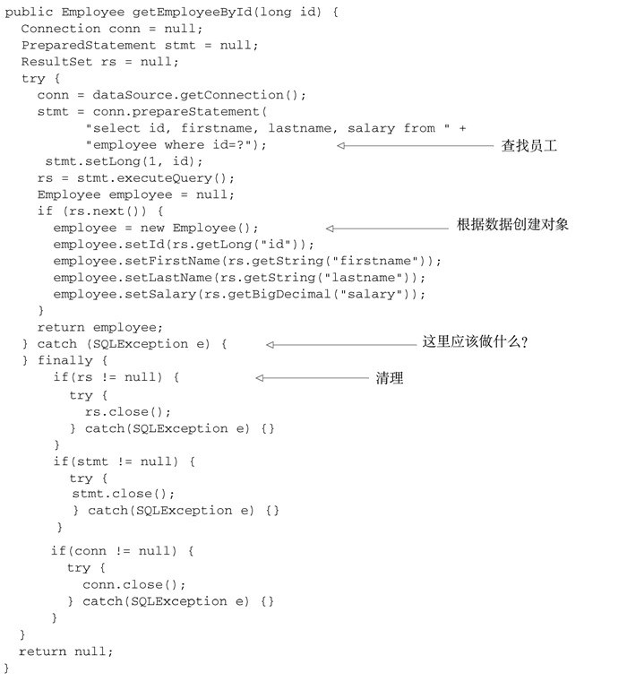
- Spring的JdbcTemplate
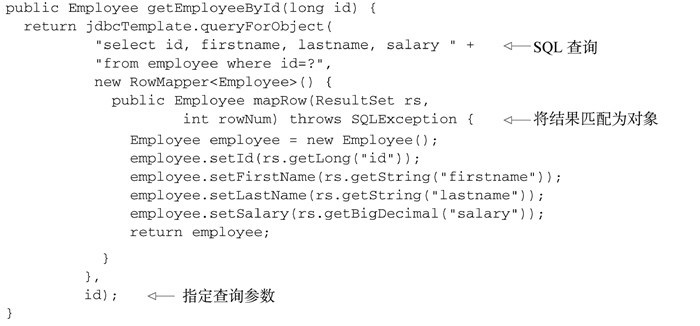
###2.容纳你的Bean
- 在Spring应用中，对象由Spring容器创建和装配，并存在容器之中
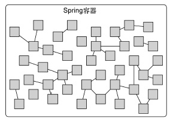
- Spring容器并不只有一个。Spring自带了多个容器的实现，可以归为两种：bean工厂时最简单的容器，提供基本的DI支持。应用上下文基于beanfactory构建，并提供应用框架级别的服务，例如从属性文件解析文本信息以及发布应用时间给感兴趣的时间监听者。通常应用上下文比bean工厂更受欢迎。
####使用应用上下文
- 常用的五种
	- FileSystemXmlapplicationcontext：从文件系统下的一个或者多个XML配置文件中加载上下文定义
	- ClassPathXmlApplicationContext：从类路径下的一个或多个XML配置文件中加载上下文定义，把应用上下文的定义文件作为类资源
	- AnnotationConfigApplicationContext：从一个或多个基于Java配置类中加载Spring应用上下文
	- AnnotationConfigWebApplicationContext：从一个或多个基于Java的配置类中加载Spring Web应用上下文
	- XmlWebApplicationContext：从Web应用下的一个或多个Xml配置文件中加载上下文定义。
- 先讲前三个
	- 它们将bean加载到bean工厂的过程都是相似的

	- 第一个和第二个的区别在于：第一个在指定的文件系统路径下查找Knight.文件，而第二个在所有的类路径（包括jar）下招「查找knight.xml文件
	- 如果想从java配置中加载应用上下文，那么可以使用AnnotationConfigApplicationCnotext

在这里没有指定加载Spring应用上下文所需的XML文件，AnnotationConfigApplicationContext通过一个配置类加载bean

应用上下文准备就绪之后，我们就可以调用上下文的getBean方法从Spring容器中获取bean。
####bean的生命周期
- bean装载到Spring应用上下文中的一个典型的声明周期过程
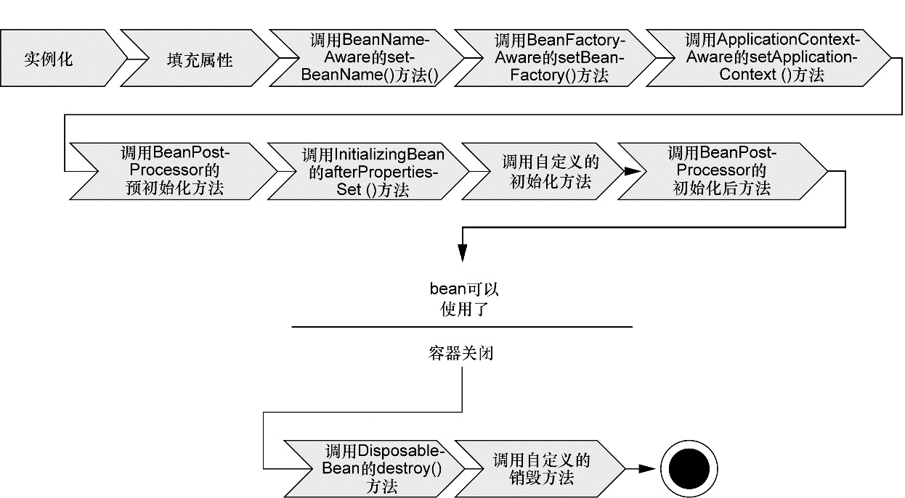
	- Spring对Bean进行实例化
	- Spring将值和bean的引用注入到bean对应的属性中
	- 如果bean实现了BeanNameAware接口，Spring将bean的ID传递给setBean-Name（）方法
	- 如果bean实现了BeanFactoryAware接口，Spring将调用setBeanFactory（）方法，将BeanFctory容器实例传入
	- 如果bean实现了ApplicationContextAware接口，Spring将调用setApplicationCOntest()方法，将bean所在的应用上下文的引用传入进来。
	- 如果实现了BeanPostProcessor接口，Spring将调用post-ProcessBeforeInitialization()方法
	- 如果实现了InitializingBean接口，将调用after-PropertiesSet()方法。类似的，如果bean
	使用init-method声明了初始化方法，该方法也会被调用
	- 如果实现了BeanPostProcessor接口，将调用after-ProcessAfterInitialization()方法
	- 此时，bena已经准备就绪，可以被应用程序使用了，它们将一直驻留在应用上下文中，直到应用上下文被销毁
	- 如果bean实现了DisposableBean接口，Spring将调用他的destroy（）接口方法，同样，如果bean使用destroy-method声明了销毁方法，该方法也会被调用
###3. 俯瞰Spring风景线

####Spring模块
- Spring4.0 包含20个不同模块，那枚个模块会有3个jar文件（二进制类库，源码的jar文件以及javadoc的jar文件）
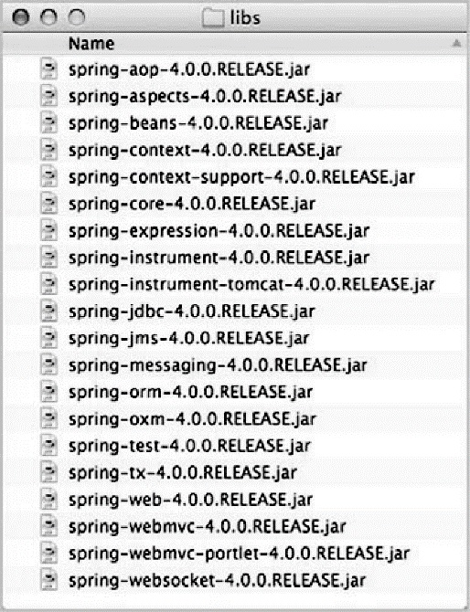
- 分为6类不同的功能
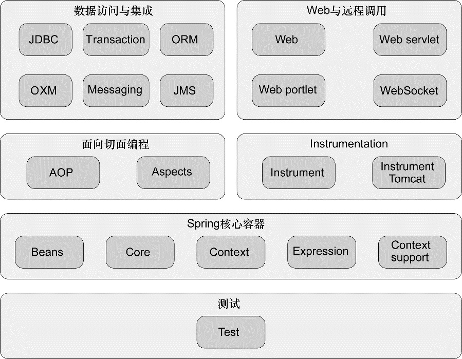
	- Spring核心容器
		- 最核心的部分，管理这Spring应用中的bean创建，配置和管理。在该模块中，包括了Spring bean工厂。他为Spring提供了DI功能，基于bean工厂，我们还会发现有多种Spring应用上下文的实现，每一种都提供了配置Spring的不同方式
		- 除了bean工厂和应用上下文，该模块也提供了许多企业服务，例如E-mail，JNDI访问，EJB集成和调度
		- 所有的Spring模块都构建于核心容器之上
	- Spring的AOP模块
	是Spring应用系统中开发切面的基础。与DI一样，AOP可以帮助解偶。借助他，可以将遍布系统的关注点（例如事务和安全）从它们所应用的对象中解耦出来。
	- 数据访问与集成
		- Spring的JDBC和Dao模块抽象了这些样板式代码。
		- 对于更加喜欢ORM的开发者，Spring提供了ORM模块，建立在对DAO的支持之上，Spring并没有尝试去创建自己的ORM解决方案，而是对许多流行的ORM框架进行集成
		- 同样包含了在JMS之上构建的Spring抽象层，它会使用消息以一部的方式与其他应用集成。还包含对象到XML映射的特性，他最初时Spring Web Service项目的一部分
	- Web与远程调用
	- Instrumentation 
	提供了为JVM添加代理的功能。具体就是它为Tomcat提供了一个织入代理，能够为Tomcat传递类文件，就像这些文件是被类加载器加载的一样
	-测试
####Spring Portfolio

	