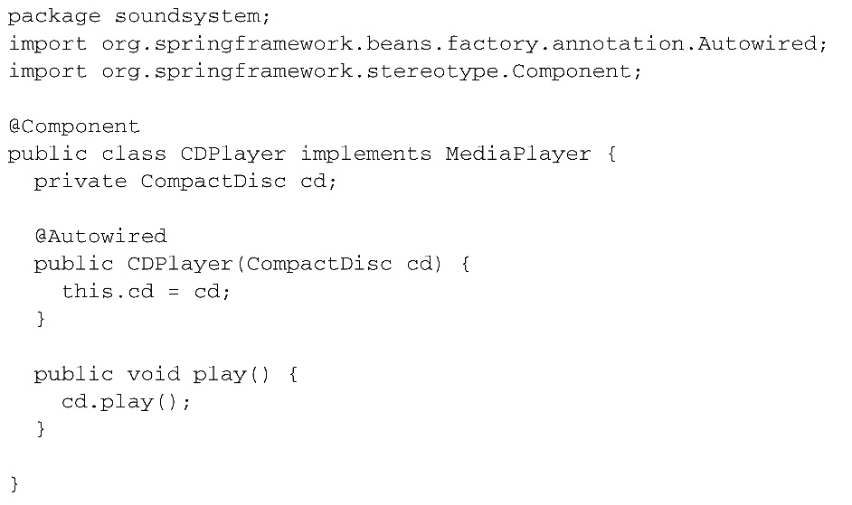
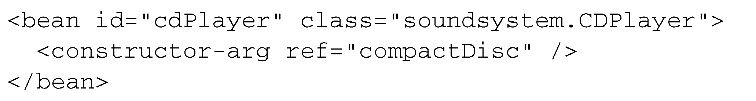

#第二章：装配 Bean
###1. Spring配置的可选方案
- 在XML中进行显示配置
- 在Java中进行显示配置
- 隐式的bean发现机制和自动装配（推荐）
###2. 自动化装配bean
- 从两个角度来实现自动化装配
	- 组件扫描: Spring会自动发现应用上下文中所创建的bean
	- 自动装配：Spring自动满足bean之间的依赖
- 组合在一起发挥强大的为例
####创建可被发现的bean
- 先定义个接口

- 实现类+注解，表明该类会作为组件类，并告知Spring要为这个类创建bean。

- 不过，组件扫描默认是不启用的。我们还需要显示配置下Spring，从而命令它去找带有@component注解的类。查找其所在包以及自爆的带有该注解的类，并自动创建bean（以配置类所在的包作为基础包来扫描组件）。

- 同时也可以使用XML启用组件扫描（更喜欢前一种java配置）

####为组件扫描的bean命名
- Spring应用上下文中所有的bean都会定一个ID，自动会是类名第一个字母小写
- 想设置不同的id的方案1（一般用这个）
 
 - java依赖注入规范中的方法（方案2）
 
####设置组件扫描的基础包
- 想扫描不同的包：在@ComponentScan的value属性中指明包的名称

- 想更清楚的表明所设置的时基础包

- 上边的例子，所设置的基础包是以String类型表示的，这种方法是类型不安全的。如果重构代码的话，那么所指定的基础包可能就会出现错误了，所以可以将器指定为保重所包含的类或接口

####通过为bean添加注解实现自动装配
- 简单来说：自动装配就是让Spring自动满足bean依赖的一种方法，在满足依赖的过程中，会在Spring应用上下文中寻找匹配某个bean需求的其他bean。为了声明要进行自动装配，我们可以借助Spring的@Autowired注解
- 构造器上添加了该注解，表明会通过构造器进行实例化并且会传入一个客设置给CompactDisc类型的bean

- 该注解还能用在Setter方法上

- Spring初始化bean后，会尽可能的去满足bean的依赖，在本例中，依赖时通过带有@Autowired注解的方法进行声明的，也就是setCompactDisc
- 该注解可以用在类的任何方法上

- 满足声明的依赖时
	- 假如只有一个bean匹配，那么bean被装配
	- 没有匹配的话，旧抛出异常，为了避免异常，可以将该注释的required属性设置为false。这个时候bean处于未装配状态。但是，要谨慎，如果代码中没有进行null检查，未装配状态的属性有可能会出现空指针异常。
	- 如果多个bean都满足，那么Spring会抛出异常

- @Autowired是Spring特有的注解。可以替换为@Inject，源于java注入规范

####验证自动装配

###3. 通过Java代码装配Bean
- 有时候自动化装配的方式是行不通的，例如要将第三方库中的组件装配到应用当中。有java和xml两种方式。
	- javaconfig是更好的方案，因为它更强大，类型安全并且对重构友好
	- javaconfig与普通java代码的区别：在概念上，他与应用程序中的业务逻辑和领域代码时不同的，不应包含任何业务逻辑，也不应该侵入到业务逻辑代码之中。一般将javaconfig放到单独的包当中
####创建配置类
- 
####声明简单的bean
- @bean注解会告诉Spring这个方法将会返回一个对象，该对象要注册为Spring应用上下文中的bean，方法体中包含最终产生bean实例的逻辑。一般bean的名字和类名一样

- 不同的名字

- 稍加改变

####借助JavaConfig实现注入
- 声明CDPlayer，和sgtPeppers方法一样，使用了#bean注解，表明会创建一个bean实例并将其注册到Spring应用上下文中

- 看起来Compact是通过sgtPeppers()得到的，但是并不是，因为sgtPeppers（）方法上添加了Bean注解，Spring将会拦截所有对它的调用，并确保直接返回该方法所创建的bean，而不是每次都对其进行实际的调用
比如引入另一个CDPlayerbean，和之前的哪个一模一样

如果对sgtPeppers的调用和其他java方法一样的话，每个CD实例都会有一个自己的sgt实例，在软件中，完全可以将同一个sgt实例注入到任意数量的bean之中。默认中Spring中的bean是单例的，所以Spring会拦截对sgt（）的调用并确保返回的是Spring所创建的bean，也就是Spring本身在调用sgt（）时所创建的额CompactDiscBean。因此两个cd得到吸纳高通的sgt实例
- 更简单的例子：不管CompactDisc是什么方式创建的额，Spring都会将其传入到配置方法中

- 用setter方法注入

###4. 通过XML装配bean
####创建XML配置规范

####声明一个简单的``<bean>``
- 因为没有明确id所以必须要用全类名，id默认为全类名后+#0，计数上升

- 一般这样

####借助构造器注入初始化bean
- 配置方案
	- ``<constructor-arg>``元素
	- 使用c- 命名空间
- 构造器注入bean引用：Spring遇到之歌``<bean>``元素时，会创建一个CDPlayer实例。``<constructor-arg>``元素会告知Spring要将一个ID为CompactDISC的bean引用传到CDPlayer的构造器中

- c-命名空间，要在顶部声明

	- 命名规则

	- 不同替代类名方案

- 将字面量注入到构造器中
- 要做的事情：只是用一个字面量值配置对象

	- 想要设置成任意艺术家和唱片名
	
	- 有集合类的时候
	
####设置属性
- 这个例子应该算属性注入：对强依赖使用构造器注入，对可选性依赖使用属性注入

- 构造器注入有c，属性注入有p

- 字面量注入到属性

###5. 导入和混合配置
####在javaconfig中引用XML配置
- 组合的方式

- 如何让Spring同时加载它和其他基于java的配置呢

####在XML配置中引用JavaConfig

