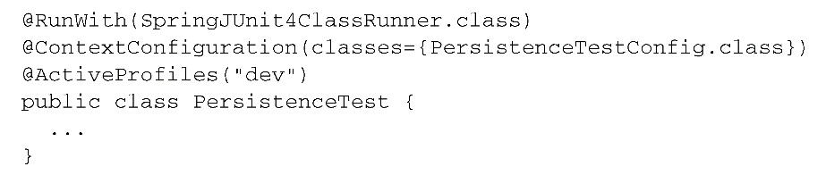
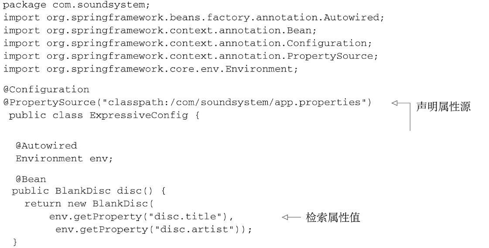
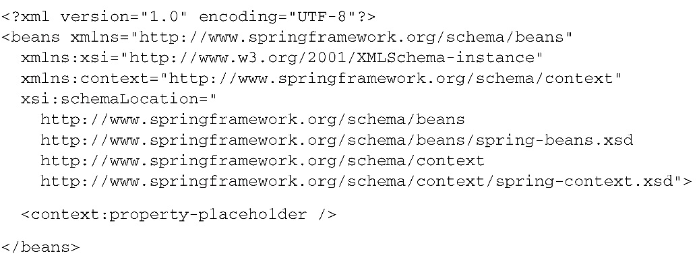
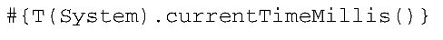
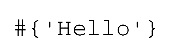

#第三章：高级装配
###1. 环境与profile
- 软件开发和思的挑战：将引用程序从一个环境迁移到另外环境。开发环境与生产环境的不同。
- 我们来考虑下数据库配置
	- 开发环境：使用嵌入式数据库，并预先加载测试数据：会创建一个javax.sql.DatSourse的bean。使用Em...Builder会搭建一个嵌入式的Hypersonic数据库，模式定义在schema.sql中，测试数据通过test-data.sql加载的
	
	- 生产环境时，上边的方法旧非常糟糕了，生产环境的配置，我们倾向于使用JNDI从容器中获取一个DataSourse。这种方式获取Datasourse能够让容器决定如何创建这个DataSourse，甚至包括切换为容器管理的连接池。对于简单的集成和开发下颚时环境来说，这回带来不必要的复杂性
	
	- 在QA环境中，可以选择完全不同的Datasourse配置，Commons DBCP
	
- 以上的三种方法的datasourse方法不同，表明了在不同环境下某个bean会有所不同，我们必须要有一种方法来配置DataSourse，使其在每种环境下都会选择最为合适的配置
- 其中一种方式就是在单独的配置类或xml文件中配置每个bean，然后在构建阶段确定要将哪个配置编译到可部署的旖旎改用中。值得庆幸的是，Spring所提供的解决方案并不需要重新构建
####配置progile bean
- Spring为环境相关的bean提供的解决方案：需要根据环境决定创建哪个bean和不创建哪个bean，不是在构建的时候作出的决策，而是在运行的时候决定的，结果是同一个部署单元（可能会是WAR文件）能够适用于所有的环境，没有必要进行重构
- 要使用bean，首先要将所有不同的bean定义整理到一个或多个profile之中，将应用部署到每个环境时，要确保对应的profile处于激活状态
- 在Java配置中，可以使用@prifile注解指定某个bean属于哪个profile。下图是说：告诉Spring这个配置类中的bean只有在dev profile激活时才会被创建。如果没有激活的话，那么带有bean注解的方法都会被忽略掉

- 我们可以在类上，在方法上使用prfile注解：这样可以将两个bean的声明放到同一个配置类之中

- 没有指定profile的bean始终都会被创建，与激活哪个profile没有关系
- 在XML中配置profile
	- ``<beans>``元素的profile属性

	- ``<beans>``元素中嵌套定义``<beans>``元素，而不是为每个环境都创建一个profile。也就是可以将所有的profile bean定义放到同一个xml文件中

####激活profile
- Spring在确定哪个peofile处于激活状态时，需要依赖两个独立的属性：Spring.profiles.active和spring.profiles.default。如果设置了第一个属性，呢么它的值就会用来确定哪个profile是激活的，没有设置的话，救火查找default的值，都没有的话，只会创建那些没有定义在profile中的bean
-设置这两个属性
	- 作为DispacherServlet的初始化参数
	- 作为Web应用的上下文参数
	- 作为JNDI条目
	- 作为环境变量。
	- 作为JVM系统属性
	- 在集成测试类上，使用@ActiveProfiles注解设置
	- 例子：在web应用的web.xml文件中设置默认的profile  使用注解
	
	
- 在条件化创建bean方面，Spring的profile机制很棒，通过激活状态判断。在Spring4.0中，提供了一种更为通用的机制来实现条件化的bean定义，在这种机制中，条件完全由你来定：@Conditional注解定义条件化的bean
###2. 条件化的bean
- 需求：根据环境中是否存在magic属性来作出决策
	- 条件化配置bean：给@Conditional定了一个class。指明了条件。也就是MagicExistsCondition。@Conditional将通过Condition接口进行条件对比

	- 完成对比功能的Condition类

- ConditionContext是一个接口

- AnnotatedTypeMetadata则能够让我们检查带有@bean主角的方法上还有什么其他的注解。

###3. 处理自动装配的奇异性
- 自动装配的歧义性：不仅有依法额bean能够匹配结果，Spring提供了多种可选方案解决问题：如首选bean，限制bean
####标示首选的bean
- 将@Component注解的bean设为首选

- Java配置显示声明

- Xml配置

####限制自动装配的bean

###4. bean 的作用域
- 默认情况下：Spring上下文中所有的bean都是单例形式创建的。。不管给定的bean被注入到其他bean多少次，每次注入的都是同一个实例
- 有时候，所使用的类是易变的，会保持一些状态，因此重用不安全。这时对象可能会被污染。
- Spring定义了多种作用域，可以基于这些作用域创建bean
	- 单例：在整个应用中，只创建bean的一个实例
	- 原型：每次注入或者通过Spring应用上下文获取的时候，都会创建一个新的bean实例
	- 会话：在WEB应用中，为每个会话创建一个bean实例
	- 请求：在WEB应用中，为每个请求创建一个bean实例
- 单例是默认的作用域，选择其他的作用域，要使用@Scope，可以和@Component和@bean一起使用
	- 原子型:  使用SCOPE_PROTOTYPE常量更加安全，@Scope("prototype")就没有这么安全了

- 使用XML

####使用会话和请求作用域
- 作用域代理能够延迟注入请求和会话作用域的bean

####在XML中声明作用域代理
- 要使用Spring aop命名空间的agiel新元素``<aop:scoped-proxy>``是与@Scope注解的procyMode属性功能相同的。默认会使用GGLib创建目标类代理，但是可以使用（接口的代理时最优的）

###5. 运行时值注入
- 讨论依赖注入的时候，通常讨论的是将一个bean引用注入到另一个bean的属性或构造器参数中。通常来将指的是将一个对象与另一个对象进行关联
- 之前讨论的值是硬编码的，如下图，但我们有时候想让这些值在运行的时候再确定，Spring提供了两种在运行时求值的方式
	- 属性占位符
	- Spring表达式语言（SpEL）

####注入外部的值
- 声明属性源并通过Spring的Environment来检索属性（使用@PropertySourse注解和Environment）

	- getProperty（）有四种重载
	
	- 不存在时判断下，避免抛异常
	
	- 想属性解析为类
	
- 解析属性占位符
	- 属性定义到外部的文件中
	
	- 如果依赖组件扫描和自动装配和初始化应用组件的化=话，就没有占位符了，用value
	
	- 为了使用占位符，我们必须要配置propertysourseplaceholderconfigurer
	 bean
	 
	-使用xml配置的话
	
- 解析外部属性能够将值的处理推迟到运行时，但是它的关注点在于根据名称来解析来自于Spring Environment和属性源的属性。
####使用Spring表达式语言进行装配
- SPEL特性
	- 使用bean的id来引用bean
	- 调用方法和访问对象的属性
	- 对值进行算数，关系和逻辑运算
	- 集合操作
-SpEL样例

- 表示字面值

- 引用bean，属性和方法，最后一个比倒二安全，防止null异常

- 在表达式中使用类型
要访问类作用域的方法和常量的话，要依赖T（），该运算符的真正价值在于它能够访问目标类型的静态方法和常量
	- 使用PI的值，调用方法
	
	
- SpEL运算符

	- 样例
	
- 计算正则表达式

- 计算集合
