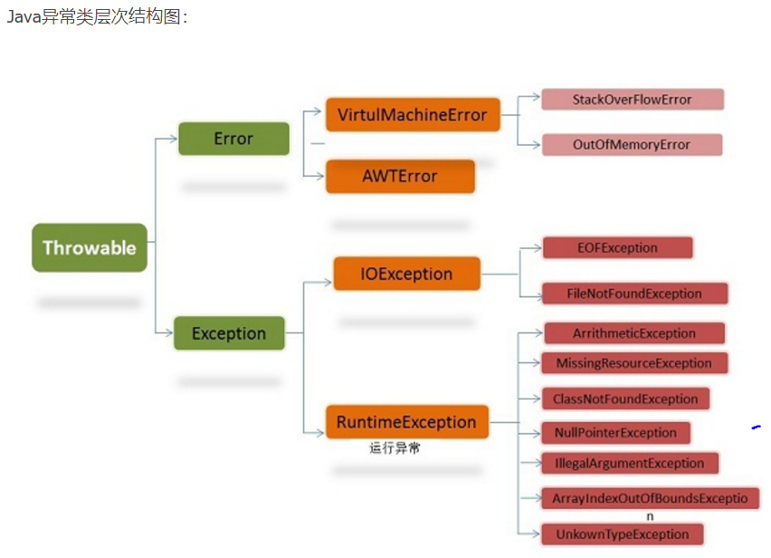
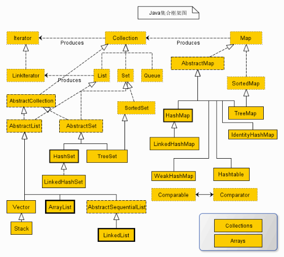
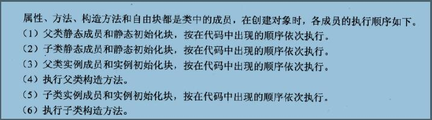

一、异常
 除了RuntimeException及其子类以外，其他的Exception类及其子类都属于可查异常。这种异常的特点是Java编译器会检查它，
不可查异常(编译器不要求强制处置的异常):包括运行时异常（RuntimeException与其子类）和错误（Error）。

Java 应用程序中，异常处理机制为：
抛出异常：当一个方法出现错误引发异常时，方法创建异常对象并交付运行时系统，异常对象中包含了异常类型和异常出现时的程序状态等异常信息。运行时系统负责寻找处置异常的代码并执行。

捕捉异常：在方法抛出异常之后，运行时系统将转为寻找合适的异常处理器（exception handler）。依次回查调用栈中的方法，直至找到含有合适异常处理器的方法并执行。当运行时系统遍历调用栈而未找到合适 的异常处理器，则运行时系统终止。同时，意味着Java程序的终止。
Java规定，运行时异常将由Java运行时系统自动抛出，允许应用程序忽略运行时异常。
一个方法所能捕捉的异常，一定是Java代码在某处所抛出的异常。简单地说，异常总是先被抛出，后被捕捉的。
finally 块：无论是否捕获或处理异常，finally块里的语句都会被执行。当在try块或catch块中遇到return语句时，finally语句块将在方法返回之前被执行。在以下4种特殊情况下，finally块不会被执行：
1）在finally语句块中发生了异常。
2）在前面的代码中用了System.exit()退出程序。
3）程序所在的线程死亡。
4）关闭CPU。
 try-catch-finally 规则

1)  必须在 try 之后添加 catch 或 finally 块。try 块后可同时接 catch 和 finally 块，但至少有一个块。
2) 必须遵循块顺序：若代码同时使用 catch 和 finally 块，则必须将 catch 块放在 try 块之后。
3) catch 块与相应的异常类的类型相关。
4) 一个 try 块可能有多个 catch 块。若如此，则执行第一个匹配块。即Java虚拟机会把实际抛出的异常对象依次和各个catch代码块声明的异常类型匹配，如果异常对象为某个异常类型或其子类的实例，就执行这个catch代码块，不会再执行其他的 catch代码块
5) 可嵌套 try-catch-finally 结构。
6) 在 try-catch-finally 结构中，可重新抛出异常。
7) 除了下列情况，总将执行 finally 做为结束：JVM 过早终止（调用 System.exit(int)）；在 finally 块中抛出一个未处理的异常；计算机断电、失火、或遭遇病毒攻击。
二、java集合类
数组（可以存储基本数据类型）是用来存现对象的一种容器，但是数组的长度固定，不适合在对象数量未知的情况下使用。
集合（只能存储对象，对象类型可以不一样）的长度可变，可在多数情况下使用。

Collection接口是集合类的根接口，Java中没有提供这个接口的直接的实现类。但是却让其被继承产生了两个接口，就是Set和List。Set中不能包含重复的元素。List是一个有序的集合，可以包含重复的元素，提供了按索引访问的方式。
Map是Java.util包中的另一个接口，它和Collection接口没有关系，是相互独立的，但是都属于集合类的一部分。Map包含了key-value对。Map不能包含重复的key，但是可以包含相同的value
Iterator，所有的集合类，都实现了Iterator接口，这是一个用于遍历集合中元素的接口，主要包含以下三种方法：
1.hasNext()是否还有下一个元素。
2.next()返回下一个元素。
3.remove()删除当前元素。

三、几种重要的接口和类简介
1、List（有序、可重复）
List里存放的对象是有序的，同时也是可以重复的，List关注的是索引，拥有一系列和索引相关的方法，查询速度快。因为往list集合里插入或删除数据时，会伴随着后面数据的移动，所有插入删除数据速度慢。
2、Set（无序、不能重复）
Set里存放的对象是无序，不能重复的，集合中的对象不按特定的方式排序，只是简单地把对象加入集合中。
3、Map（键值对、键唯一、值不唯一）
Map集合中存储的是键值对，键不能重复，值可以重复。根据键得到值，对map集合遍历时先得到键的set集合，对set集合进行遍历，得到相应的值。
对比如下：

| imp | class | is in order | can be repeat |
	| - | :-: | -: |-|
	| Collection | |否| 否 |
	| List | Gryffindor | 是 |是|
	| Set | AbstractSet | 否 |否|
	| |HashSet | 否 |
	|  |TreeSet | 是（用二叉排序树）|否|
	| Map | AbstractMap | 否 |使用key-value来映射和存储数据，key必须唯一，value可以重复|
	| Map | HashMap | 否 |使用key-value来映射和存储数据，key必须唯一，value可以重复|
	| Map | TreeMap |是（用二叉排序树） |使用key-value来映射和存储数据，key必须唯一，value可以重复|
	
	
四、遍历
 在类集中提供了以下四种的常见输出方式：
1）Iterator：迭代输出，是使用最多的输出方式。
2）ListIterator：是Iterator的子接口，专门用于输出List中的内容。
3）foreach输出：JDK1.5之后提供的新功能，可以输出数组或集合。
4）for循环
代码示例如下：
 for的形式：for（int i=0;i<arr.size();i++）{...}
 foreach的形式： for（int　i：arr）{...}
 iterator的形式：
Iterator it = arr.iterator();
while(it.hasNext()){ object o =it.next(); ...}

ArrayList和LinkedList在用法上没有区别，但是在功能上还是有区别的。LinkedList经常用在增删操作较多而查询操作很少的情况下，ArrayList则相反。

六、Map集合
实现类：HashMap、Hashtable、LinkedHashMap和TreeMap
HashMap 
HashMap是最常用的Map，它根据键的HashCode值存储数据，根据键可以直接获取它的值，具有很快的访问速度，遍历时，取得数据的顺序是完全随机的。因为键对象不可以重复，所以HashMap最多只允许一条记录的键为Null，允许多条记录的值为Null，是非同步的
Hashtable
Hashtable与HashMap类似，是HashMap的线程安全版，它支持线程的同步，即任一时刻只有一个线程能写Hashtable，因此也导致了Hashtale在写入时会比较慢，它继承自Dictionary类，不同的是它不允许记录的键或者值为null，同时效率较低。
ConcurrentHashMap
线程安全，并且锁分离。ConcurrentHashMap内部使用段(Segment)来表示这些不同的部分，每个段其实就是一个小的hash table，它们有自己的锁。只要多个修改操作发生在不同的段上，它们就可以并发进行。
LinkedHashMap
LinkedHashMap保存了记录的插入顺序，在用Iteraor遍历LinkedHashMap时，先得到的记录肯定是先插入的，在遍历的时候会比HashMap慢，有HashMap的全部特性。
TreeMap
TreeMap实现SortMap接口，能够把它保存的记录根据键排序，默认是按键值的升序排序（自然顺序），也可以指定排序的比较器，当用Iterator遍历TreeMap时，得到的记录是排过序的。不允许key值为空，非同步的；

map的遍历
第一种：KeySet()
将Map中所有的键存入到set集合中。因为set具备迭代器。所有可以迭代方式取出所有的键，再根据get方法。获取每一个键对应的值。 keySet():迭代后只能通过get()取key 。
取到的结果会乱序，是因为取得数据行主键的时候，使用了HashMap.keySet()方法，而这个方法返回的Set结果，里面的数据是乱序排放的。
典型用法如下：
Map map = new HashMap();
map.put("key1","lisi1");
map.put("key2","lisi2");
map.put("key3","lisi3");
map.put("key4","lisi4");  
//先获取map集合的所有键的set集合，keyset（）
Iterator it = map.keySet().iterator();
 //获取迭代器
while(it.hasNext()){
Object key = it.next();
System.out.println(map.get(key));
}
第二种：entrySet（）
Set<Map.Entry<K,V>> entrySet() //返回此映射中包含的映射关系的 Set 视图。（一个关系就是一个键-值对），就是把(key-value)作为一个整体一对一对地存放到Set集合当中的。Map.Entry表示映射关系。entrySet()：迭代后可以e.getKey()，e.getValue()两种方法来取key和value。返回的是Entry接口。
典型用法如下：
Map map = new HashMap();
map.put("key1","lisi1");
map.put("key2","lisi2");
map.put("key3","lisi3");
map.put("key4","lisi4");
//将map集合中的映射关系取出，存入到set集合
Iterator it = map.entrySet().iterator();
while(it.hasNext()){
Entry e =(Entry) it.next();
System.out.println("键"+e.getKey () + "的值为" + e.getValue());
}
推荐使用第二种方式，即entrySet()方法，效率较高。
对于keySet其实是遍历了2次，一次是转为iterator，一次就是从HashMap中取出key所对于的value。而entryset只是遍历了第一次，它把key和value都放到了entry中，所以快了。两种遍历的遍历时间相差还是很明显的。

七、主要实现类区别小结
Vector和ArrayList
1，vector是线程同步的，所以它也是线程安全的，而arraylist是线程异步的，是不安全的。如果不考虑到线程的安全因素，一般用arraylist效率比较高。
2，如果集合中的元素的数目大于目前集合数组的长度时，vector增长率为目前数组长度的100%，而arraylist增长率为目前数组长度的50%。如果在集合中使用数据量比较大的数据，用vector有一定的优势。
3，如果查找一个指定位置的数据，vector和arraylist使用的时间是相同的，如果频繁的访问数据，这个时候使用vector和arraylist都可以。而如果移动一个指定位置会导致后面的元素都发生移动，这个时候就应该考虑到使用linklist,因为它移动一个指定位置的数据时其它元素不移动。
ArrayList 和Vector是采用数组方式存储数据，此数组元素数大于实际存储的数据以便增加和插入元素，都允许直接序号索引元素，但是插入数据要涉及到数组元素移动等内存操作，所以索引数据快，插入数据慢，Vector由于使用了synchronized方法（线程安全）所以性能上比ArrayList要差，LinkedList使用双向链表实现存储，按序号索引数据需要进行向前或向后遍历，但是插入数据时只需要记录本项的前后项即可，所以插入数度较快。
arraylist和linkedlist
1.ArrayList是实现了基于动态数组的数据结构，LinkedList基于链表的数据结构。
2.对于随机访问get和set，ArrayList觉得优于LinkedList，因为LinkedList要移动指针。
3.对于新增和删除操作add和remove，LinedList比较占优势，因为ArrayList要移动数据。 这一点要看实际情况的。若只对单条数据插入或删除，ArrayList的速度反而优于LinkedList。但若是批量随机的插入删除数据，LinkedList的速度大大优于ArrayList. 因为ArrayList每插入一条数据，要移动插入点及之后的所有数据。
HashMap与TreeMap
1、 HashMap通过hashcode对其内容进行快速查找，而TreeMap中所有的元素都保持着某种固定的顺序，如果你需要得到一个有序的结果你就应该使用TreeMap（HashMap中元素的排列顺序是不固定的）。
2、在Map 中插入、删除和定位元素，HashMap是最好的选择。但如果您要按自然顺序或自定义顺序遍历键，那么TreeMap会更好。使用HashMap要求添加的键类明确定义了hashCode()和 equals()的实现。
两个map中的元素一样，但顺序不一样，导致hashCode()不一样。
同样做测试：
在HashMap中，同样的值的map,顺序不同，equals时，false;
而在treeMap中，同样的值的map,顺序不同,equals时，true，说明，treeMap在equals()时是整理了顺序了的。
HashTable与HashMap
1、同步性:Hashtable是线程安全的，也就是说是同步的，而HashMap是线程序不安全的，不是同步的。
2、HashMap允许存在一个为null的key，多个为null的value 。
3、hashtable的key和value都不允许为null。

算法包括0个或多个输入，1个或多个输出，中间有穷个处理过程

String,StringBuffer与StringBuilder的区别??
String 字符串常量
StringBuffer 字符串变量（线程安全）
StringBuilder 字符串变量（非线程安全）
 简要的说， String 类型和 StringBuffer 类型的主要性能区别其实在于 String 是不可变的对象, 因此在每次对 String 类型进行改变的时候其实都等同于生成了一个新的 String 对象，然后将指针指向新的 String 对象，所以经常改变内容的字符串最好不要用 String ，因为每次生成对象都会对系统性能产生影响，特别当内存中无引用对象多了以后， JVM 的 GC 就会开始工作，那速度是一定会相当慢的。
 而如果是使用 StringBuffer 类则结果就不一样了，每次结果都会对 StringBuffer 对象本身进行操作，而不是生成新的对象，再改变对象引用。所以在一般情况下我们推荐使用 StringBuffer ，特别是字符串对象经常改变的情况下。而在某些特别情况下， String 对象的字符串拼接其实是被 JVM 解释成了 StringBuffer 对象的拼接，所以这些时候 String 对象的速度并不会比 StringBuffer 对象慢，而特别是以下的字符串对象生成中， String 效率是远要比 StringBuffer 快的：
 String S1 = “This is only a” + “ simple” + “ test”;
 StringBuffer Sb = new StringBuilder(“This is only a”).append(“ simple”).append(“ test”);
 你会很惊讶的发现，生成 String S1 对象的速度简直太快了，而这个时候 StringBuffer 居然速度上根本一点都不占优势。其实这是 JVM 的一个把戏，在 JVM 眼里，这个
 String S1 = “This is only a” + “ simple” + “test”; 其实就是：
 String S1 = “This is only a simple test”; 所以当然不需要太多的时间了。但大家这里要注意的是，如果你的字符串是来自另外的 String 对象的话，速度就没那么快了，譬如：
String S2 = “This is only a”;
String S3 = “ simple”;
String S4 = “ test”;
String S1 = S2 +S3 + S4;
这时候 JVM 会规规矩矩的按照原来的方式去做

在大部分情况下 StringBuffer > String
StringBuffer
Java.lang.StringBuffer线程安全的可变字符序列。一个类似于 String 的字符串缓冲区，但不能修改。虽然在任意时间点上它都包含某种特定的字符序列，但通过某些方法调用可以改变该序列的长度和内容。
可将字符串缓冲区安全地用于多个线程。可以在必要时对这些方法进行同步，因此任意特定实例上的所有操作就好像是以串行顺序发生的，该顺序与所涉及的每个线程进行的方法调用顺序一致。
StringBuffer 上的主要操作是 append 和 insert 方法，可重载这些方法，以接受任意类型的数据。每个方法都能有效地将给定的数据转换成字符串，然后将该字符串的字符追加或插入到字符串缓冲区中。append 方法始终将这些字符添加到缓冲区的末端；而 insert 方法则在指定的点添加字符。
例如，如果 z 引用一个当前内容是“start”的字符串缓冲区对象，则此方法调用 z.append("le") 会使字符串缓冲区包含“startle”，而 z.insert(4, "le") 将更改字符串缓冲区，使之包含“starlet”。
在大部分情况下 StringBuilder > StringBuffer
java.lang.StringBuilde
java.lang.StringBuilder一个可变的字符序列是5.0新增的。此类提供一个与 StringBuffer 兼容的 API，但不保证同步。该类被设计用作 StringBuffer 的一个简易替换，用在字符串缓冲区被单个线程使用的时候（这种情况很普遍）。如果可能，建议优先采用该类，因为在大多数实现中，它比 StringBuffer 要快。两者的方法基本相同。

一 1. 两个数组的合并
2.延伸到归并排序
2.1递归
①递归的终止条件
{如果 1  
那么返回
如果 2
那么返回
}

②递归
3）回溯

全排列
