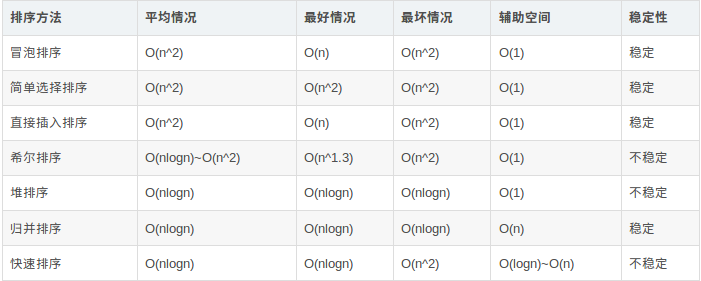

##网际控制协议：ICMP
- ICMP报文分为：
	- 差错报告报文：终点不可达，时间超过，参数问题，改变路由
	- 查询报文：回送请求或回答，时间戳请求或回答
### 分组间探测PING
- 是ICMP的重要应用，主要用来测试两台主机之间的连通性
- PING发送的IP数据报封装的是无法交付的UDP用户数据报
###Traceroute
- ICMP应用：用来跟踪一个分组从源点到终点的路径
 - 源主机知道到达目的主机所经过的路由器IP地址以及到达每个路由器的往返时间
#运输层
##TCP
- TIME_WAIT:
	- 确保最后一个确认报文段能够到达。如果 B 没收到 A 发送来的确认报文段，那么就会重新发送连接释放请求报文段，A 等待一段时间就是为了处理这种情况的发生。
	- 等待一段时间是为了让本连接持续时间内所产生的所有报文段都从网络中消失，使得下一个新的连接不会出现旧的连接请求报文段。
- TCP的特点
	- 支持面向连接：对提高传输数据的可靠性很重要：在传送数据之前，必须在源和目的之间建立一条连接
	- 支持字节流传输：流相当于一个管道，描述了一个不出现丢失，重复和乱序的传输过程。为了支持字节流传输，发送端和接收端都需要使用缓存，接收端应用程序数据字节的起始与终止位置必须由应用程序自己确定
	- 支持全双工通信：允许通信双方的应用程序在任何时候都可以发送数据
	- 支持同时简历多个并发的TCP连接
	- 支持可靠的传输服务：使用确认机制检查数据是否安全和完整的到达，并且提供拥塞控制功能。可靠传输的关键是对发送和接收的数据进行跟踪，确认与重传。
	- 确认号501,意味着500个已经传输成功，下一个请发送501
###TCP报文格式
- 报头格式20-60字节
	- 控制字段：
		紧急URG位：置1,表示该报文的优先级为高，它要与紧急指针字段一起用
		确认ACK 
		推送PSH：两个进程交互式通信时，一段应用进程希望在输入一个命令之后，能够立即得到对方的响应时，置1
		复位RST：一是主机崩溃等原因造成TCP连接出错，需要立即释放连接，然后在重建连接，二是拒绝一个非法的TCP报文或拒绝释放一个连接
		同步SYN：在建立连接时来同步序号
		终止FIN：释放TCP连接，表示发送端的报文端已经发送完毕
	- 窗口：字段长度为16位
		- 由于接收端的接收缓冲区是受到限制的，因此需要设置一个窗口字段表示下一次传输接收端还有多大的接收容量。窗口字段值是准备接收下一个TCP报文段的接收端，通知即将发送报文段的发送端，下一次最多可以发送的报文段的字节数
		- 发送端将根据通知的窗口值来调整自己的发送窗口值大小
		- 窗口字段值是动态变化的
- MSS是TCP报文中数据部分的最大字节数限定值：默认536
要考虑协议的开销，ip分片，发送和接收缓冲区的限制
- 报文的传输过程中：服务端设置保持计时器
	- 防止TCP处于长时间的空闲
	- 当服务端受到客户端的报文时，计时器就复位。如果过了设定的时间没有受到客户端信息，就发送探测报文，如果发送10个探测报文（75秒一个）还没有响应，旧假设客户端出现故障，终止连接
##字节流传输状态分类与窗口的概念
- TCP使用以字节为单位的滑动窗口协议来控制字节流的发送，接收，确认与重传过程
	- TCP使用两个缓存和一个窗口来控制字节流传输。发送端缓存来存储应用进程准备发送的数据。发送端对这个缓存设置了发送窗口，只要这个窗口值部不为0就可以发送报文段。TCP的接收端也有个缓存。将正确收到的字节写入缓存，接收端设置一个接收窗口，窗口值等于接收缓存可以继续接收多少字节流的大小
	- 接收端通过TCP报头通知发送端，已经正确接收的字节号，以及发送端还能够连续发送的字节数。
	- 接收窗口的大小由接收端根据接收缓存剩余的空间大小，以及应用程序进程读取的速度决定。**发送窗口大小取决于接收窗口大小**。
	- TCP是将字节流分成段，一个段大的多少个字节打包成一个TCP报文段一起发送，一起确认。协议通过报头的序号来标识发送的字节，用确认号来表示哪些字节已经被正确的接收
- 传输字节流状态分类
	- 4类：
	尚未发送，且接收方没做好接收准备
	未发送，做好接收准备
	发送，没确认
	发送，确认
- 发送窗口与可用窗口
	- 发送窗口：2+3
	- 可用窗口：3
- 滑动窗口协议的特点：
	- 使用发送与接收缓冲区，以及滑动窗口机制来控制TCP连接上的字节流传输
	- 滑动窗口是面向字节的，可以起到差错控制的作用
	- 接收端可以在任何时候发送确认，窗口大小可以由接收端来根据需要增大或减小
##选择重传策略
- 拉回方式
- 选择重传方式
##重传计时器（重传是TCP可靠性的表现）
- 作用：
	- 测量该报文从发送到确认的往返时间
	- 如果出现超时，重传
- 这个计时器来控制报文确认和等待重传的时间
- 当TCP发送一个报文时，首先将它的一个报文的副本放入重传队列，同时启动一个重传计时器，倒计时，倒计时之前受到确认，表明传输成功，没收到，旧重传该报文
- 超时重传时间的选择
	- 当前最佳往返时间RTT值的估算
	```
	RTT=a*RTT+M
	a是加权因子，接近0,表示短暂的延迟变化对RTT影响不大，接近1,RTT将仅仅跟随往返时间变化，默认0.125
	```
	- 超时重传时间
	```
RTO=RTT+4×RTT（D）
RTT（D）为RTT的偏差加权值
	```
##TCP窗口与流量控制
- 流量控制算法的目的是控制发送端发送发送速率使之不超过接收端的速率，防止出现由于接收端来不及接收送达的字节流，而出现报文段丢失的现象，滑动窗口协议尅与利用TCP报头中的窗口字段，方便的实现流量控制
- 利用滑动窗口进行流量控制的过程
在流控过程中，接收窗口又称为通知窗口，接收端根据接收能力选择一个合适的接收窗口值，将它写到TCP的报头中，将当前接收端的接收状态通知给发送端，发送端的发送窗口不能够超过接收窗口的数值
	- 当接收端应用进程从缓存中读取字节的速度大于或等于字节到达的速度时，接收端需要在每个确认中发送一个非零的窗口通告
	- 当发送端发送的速度比较快时，缓冲区将全部占用，之后到达的字节将因缓冲区溢出而丢弃。这时，接收端必须发送零窗口通知，发送端接收到一个零窗口通知时，停止发送，直到下一个接收端重新发送非零窗口通知
- 坚持计时器
在滑动窗口控制过程中，要求发送端在接收到零窗口后停止发送，直到接收端发送非零窗口通告。非零窗口通告丢失的话，发送端处于无休止的等待，造成死锁，防止死锁，有一个坚持计时器
	- 当发送端的TCP收到零窗口通知时，旧启用坚持计时器，时间到了，就发送零窗口探测报文，探测报文不需要确认，只有一个字节，一个序号，目的只是为了提醒接收端：非零窗口通知丢失，要重传
	- 坚持计时器的值设置为重传时间的数值，最大60s，如果发出的第一个零窗口探测报文没有应答，就发送第二个，直到收到为止
##TCP窗口与拥塞控制
- 拥塞控制的基本概念
	- 防止过多的报文进入网络，而造成路由器与链路过载。
	- 流量控制的重点是放在点-点链路的通信量的局部控制上，而拥塞控制重点是放在进入网络报文总量的全局控制上
	- 造成拥塞的原因：链路带宽，路由器处理分组的能力，节点缓存与处理数据的能力，路由选择算法，流量控制算法
	总的来说就是对网络资源的需求>网络可用资源
	- 当网络负载达到一定程度，会造成死锁
- 拥塞窗口的概念
	- 假设报文是单方向传输，并且接收端有足够的缓存空间，发送窗口的大小只由网络拥塞程度来决定
	- 拥塞窗口是根据发送端根据网络拥塞情况确定的窗口值。发送端在真正确定发送窗口时，应该取通知窗口与拥塞窗口的较小值。没有拥塞时，拥塞窗口等于通知窗口，发送端在确定拥塞窗口时可以采用慢开始与拥塞避免算法
##慢开始与拥塞避免算法（加性增，乘性减）
- 算法基本思想
TCP连接中，发送端需要维持一个拥塞窗口的状态参数。拥塞窗口的状态根据网络的拥塞情况动态调整，只要网络没有出现拥塞，发送端旧逐步增大拥塞窗口，出现拥塞，拥塞窗口就减小。问题有：如何发现网络出现拥塞了呢：在这个算法中，是通过路由器是否丢弃分组确定的。这里假定通信线路质量比较好
- 慢开始过程
	- 将第一个从发送端发送报文到接收端，接收端在规定时间内返回了确认报文为一个往返。
	- 主机在简历一个TCP连接的初始化时，将慢开始的值确定为1,第一个往返将拥塞窗口设置为2,然后向接收端发送两个最大报文段。
	- 如果接收端在定期器允许的往返时间内返回确认，表示网络没有拥塞，窗口以此类推二进制增长
	- 如果在规定的时间内没有收到确认报文，就表明网络开始出现拥塞
		- 为了避免拥塞窗口增长过快，我们还定义了慢开始阈值
			- 拥塞窗口<慢开始阈值，使用慢开始算法
			- 拥塞窗口>慢开始阈值，拥塞控制算法
			- 拥塞窗口=慢开始阈值，慢开始算法和拥塞控制算法都可以
	- 在慢开始阶段，如果长度为32时出现超时，那么发送端就可以将慢开始阈值设置为出现拥塞值32的一般16
- 拥塞避免算法
	- 慢开始阶段：我们设置了慢开始初始阈值：16,经过4次之后，达到阈值，我们进入拥塞避免的控制阶段
	- 拥塞避免阶段：拥塞窗口呈线性增长，假如在拥塞窗口达到24时，发送端检测到超时，那么拥塞窗口重新设置为1,
	- 重新进入慢开始与拥塞控制阶段：慢开始阈值变成了12,然后重复
##快重传与快恢复
- 假设使用慢开始与拥塞避免的方法，假设M1-M7连续发送报文时，只有M3在传输过程中丢失，其他的都正确接收，我们不能根据M3丢失而判断拥塞
- 在这样的情况出现后，接收端及时向发送端发送三次对M2的确认，要求发送端尽早重传未被确认的报文
- 收到第一个重复确认，拥塞窗口变成最大值的1/2,以此类推，直到第三次
##排序


端到端系统设计理念
分布式故障排除‘路由，网络交换，路由原理
tcp/ip协议，了解	
##HTTP HTTPS协议
- HTTP+加密+认证+完整性保护=HTTPS
- http是HTTP协议运行在TCP之上。所有传输的内容都是明文，客户端和服务器端都无法验证对方的身份。
- https是HTTP运行在SSL/TLS之上，SSL/TLS运行在TCP之上。所有传输的内容都经过加密，加密采用对称加密，但对称加密的密钥用服务器方的证书进行了非对称加密。此外客户端可以验证服务器端的身份，如果配置了客户端验证，服务器方也可以验证客户端的身份。
- https协议需要到ca申请证书，一般免费证书较少，因而需要一定费用。
- http和https使用的是完全不同的连接方式，用的端口也不一样，前者是80，后者是443。
##https缺点
- HTTPS协议握手阶段比较费时，会使页面的加载时间延长近50%，增加10%到20%的耗电；
- HTTPS连接缓存不如HTTP高效，会增加数据开销和功耗，甚至已有的安全措施也会因此而受到影响；
- SSL证书需要钱，功能越强大的证书费用越高，个人网站、小网站没有必要一般不会用。
- SSL证书通常需要绑定IP，不能在同一IP上绑定多个域名，IPv4资源不可能支撑这个消耗。
- HTTPS协议的加密范围也比较有限，在黑客攻击、拒绝服务攻击、服务器劫持等方面几乎起不到什么作用。最关键的，SSL证书的信用链体系并不安全，特别是在某些国家可以控制CA根证书的情况下，中间人攻击一样可行。
##Socket
- 两台计算机间进行通讯需要以下三个条件：
            IP地址、协议、端口号
-          Socket原理机制：
             通信的两端都有Socket
             网络通信其实就是Socket间的通信
             数据在两个Socket间通过IO传输  
###TCP编程
- Java中基于TCP协议实现网络通信的类：  客户端的Socket类   服务器端的ServerSocket类
-    Socket通信的步骤
                 ① 创建ServerSocket和Socket   ② 打开连接到Socket的输入/输出流
  		③ 按照协议对Socket进行读/写操作  ④ 关闭输入输出流、关闭Socket
-  服务器端：
                 ① 创建ServerSocket对象，绑定监听端口 ② 通过accept()方法监听客户端请求
                 ③ 连接建立后，通过输入流读取客户端发送的请求信息  ④ 通过输出流向客户端发送乡音信息  ⑤ 关闭相关资源
  - 客户端：
                 ① 创建Socket对象，指明需要连接的服务器的地址和端口号② 连接建立后，通过输出流想服务器端发送请求信息
                 ③ 通过输入流获取服务器响应的信息 ④ 关闭响应资源
- 应用多线程实现服务器与多客户端之间的通信
               ① 服务器端创建ServerSocket，循环调用accept()等待客户端连接② 客户端创建一个socket并请求和服务器端连接
               ③ 服务器端接受苦读段请求，创建socket与该客户建立专线连接④ 建立连接的两个socket在一个单独的线程上对话
               ⑤ 服务器端继续等待新的连接  
##UDP编程
- DatagramPacket类:表示数据报包       DatagramSocket类：进行端到端通信的类
-  服务器端实现步骤
           ① 创建DatagramSocket，指定端口号  ② 创建DatagramPacket
           ③ 接受客户端发送的数据信息   ④ 读取数据
-  客户端实现步骤
       ① 定义发送信息② 创建DatagramPacket，包含将要发送的信息
           ③ 创建DatagramSocket ④ 发送数据
##进程间通信的方式
- 管道（Pipe）：半双工的通信方式，数据只能单向流动，而且只能在具有亲缘关系的进程间使用。进程的亲缘关系通常是指父子进程关系。当一个管道建立时，它会创建两个文件描述符,要关闭管道只需将这两个文件描述符关闭即可。它可以看成是一种特殊的文件，对于它的读写也可以使用普通的read、write 等函数。但是它不是普通的文件，并不属于其他任何文件系统，并且只存在于内存中。
- 命名管道（named pipe）：命名管道克服了管道没有名字的限制，除具有管道所具有的功能外，它还允许无亲缘关系进程间的通信。FIFO有路径名与之相关联,它以一种特殊设备文件形式存在于文件系统中。
- 信号（Signal）：信号是比较复杂的通信方式，用于通知接受进程有某种事件发生，除了用于进程间通信外，进程还可以发送 信号给进程本身。
- 消息队列：包括Posix消息队列system V消息队列。消息队列是由消息的链表，存放在内核中并由消息队列标识符标识。一个消息队列由一个标识符（即队列ID）来标识。消息队列克服了信号传递信息少、管道只能承载无格式字节流以及缓冲区大小受限等缺点。
	- 消息队列是面向记录的，其中的消息具有特定的格式以及特定的优先级。
	- 消息队列独立于发送与接收进程。进程终止时，消息队列及其内容并不会被删除。
	- 消息队列可以实现消息的随机查询,消息不一定要以先进先出的次序读取,也可以按消息的类型读取。

- 共享内存：共享内存就是映射一段能被其他进程所访问的内存，这段共享内存由一个进程创建，但多个进程都可以访问。共享内存是最快的 IPC 方式，它是针对其他进程间通信方式运行效率低而专门设计的。它往往与其他通信机制，如信号两，配合使用，来实现进程间的同步和通信。
	-   共享内存是最快的一种 IPC，因为进程是直接对内存进行存取。
	-  因为多个进程可以同时操作，所以需要进行同步。
	-    信号量+共享内存通常结合在一起使用，信号量用来同步对共享内存的访问。
		- 共享内存用来传递数据；
    信号量用来同步；
    消息队列用来 在客户端修改了共享内存后 通知服务器读取。
- 内存映射（mapped memory）：内存映射允许任何多个进程间通信，每一个使用该机制的进程通过把一个共享的文件映射到自己的进程地址空间来实现它。
- 信号量（semaphore）：主要作为进程间以及同一进程不同线程之间的同步手段。是一个计数器，可以用来控制多个进程对共享资源的访问。它常作为一种锁机制，防止某进程正在访问共享资源时，其他进程也访问该资源。
- 套接口（Socket）：更为一般的进程间通信机制，可用于不同机器之间的进程间通信。
- 管道：速度慢，容量有限，只有父子进程能通讯    
FIFO：任何进程间都能通讯，但速度慢    
消息队列：容量受到系统限制，且要注意第一次读的时候，要考虑上一次没有读完数据的问题    
信号量：不能传递复杂消息，只能用来同步    
共享内存区：能够很容易控制容量，速度快，但要保持同步，比如一个进程在写的时候，另一个进程要注意读写的问题，相当于线程中的线程安全，当然，共享内存区同样可以用作线程间通讯，不过没这个必要，线程间本来就已经共享了同一进程内的一块内存
##JVM内存模型
### 线程私有
- (程序计数器):当前线程所执行字节码的行号指示器(类似于传统CPU模型中的PC), PC在每次指令执行后自增, 维护下一个将要执行指令的地址. 在JVM模型中, 字节码解释器就是通过改变PC值来选取下一条需要执行的字节码指令,分支、循环、跳转、异常处理、线程恢复等基础功能都需要依赖PC完成
- Java Stack(虚拟机栈)：Java方法执行的内存模型: 每个方法被执行时会创建一个栈帧(Stack Frame)用于存储局部变量表、操作数栈、动态链接、方法出口等信息. 每个方法被调用至返回的过程, 就对应着一个栈帧在虚拟机栈中从入栈到出栈的过程(VM提供了-Xss来指定线程的最大栈空间, 该参数也直接决定了函数调用的最大深度). 
- Native Method Stack(本地方法栈)：本地方法栈则为Native方法服务, 如果一个VM实现使用C-linkage模型来支持Native调用, 那么该栈将会是一个C栈
###共享区域
-  Heap(Java堆)
几乎所有对象实例和数组都要在堆上分配(栈上分配、标量替换除外), 因此是VM管理的最大一块内存, 也是垃圾收集器的主要活动区域. 由于现代VM采用分代收集算法, 因此Java堆从GC的角度还可以细分为: 新生代(Eden区、From Survivor区和To Survivor区)和老年代; 而从内存分配的角度来看, 线程共享的Java堆还还可以划分出多个线程私有的分配缓冲区(TLAB). 而进一步划分的目的是为了更好地回收内存和更快地分配内存.
- Method Area(方法区)
用于存储被JVM加载的类信息、常量、静态变量、即时编译器编译后的代码等数据.
##动态选路协议
- 静态选路：默认方式生成(直连接口)，通过route增加，通过ICMP重定向生成(默认方式出错)。
- 动态选路：相邻路由之间的通信，以告知对方每个路由器当前所连接的网络。其改变的是选路策略，在路由表中动态的添加或删除信息。
- 自治系统内选路协议
	- 内部网关协议IGP（Interior Gateway Protocol）。每个自治系统可以选择该自治系统中各个路由器之间的选路协议。
	- 最常用的IGP是选路信息协议RIP(Routing Infromation Protocol)；使用UDP封装。
###RIP DV（距离向量）协议（收敛慢）
- RIP 协议的特点是：
	- 仅和相邻路由器交换信息。【注】如果两个路由器之间的通信不需要经过另一个路由器，那么这两个路由器就是相邻的。RIP协议规定，不相邻的路由器不交换信息。
	- 路由器交换的信息是当前本路由器所知道的全部信息，即自己的路由表。交换的信息是：“我到本自治制系统中所有网路的（最短）距离，以及到每个网络应该经过的下一跳路由器。”
	- 按固定的时间间隔交换路由信息。【注】每个30秒，然后路由器根据收到的路由信息更新路由表。当网路拓扑发生变化时，路由器也及时向相邻路由器通告拓扑变化后的路由信息。 
###OSPF  LS（链路状态） 低价斯卡
##GC
-  那些内存需要回收？(对象是否可以被回收的两种经典算法: 引用计数法 和 可达性分析算法)
- 什么时候回收？ （堆的新生代、老年代、永久代的垃圾回收时机，MinorGC 和 FullGC）
- 如何回收？(三种经典垃圾回收算法(标记清除算法、复制算法、标记整理算法)及分代收集算法 和 七种垃圾收集器)
- 引用计数法：判断对象的引用数量（早期）任何引用计数为0的对象实例可以被当作垃圾收集。 对象之间相互循环引用，对象objA和objB之间的引用计数永远不可能为 0，无法解决
- 可达性分析算法：判断对象的引用链是否可达
- 标记清除算法：分为标记和清除两个阶段。该算法首先从根集合进行扫描，对存活的对象对象标记，标记完毕后，再扫描整个空间中未被标记的对象并进行回收，
	- 效率问题：标记和清除两个过程的效率都不高;
	- 空间问题：标记-清除算法不需要进行对象的移动，并且仅对不存活的对象进行处理，因此标记清除之后会产生大量不连续的内存碎片，空间碎片太多可能会导致以后在程序运行过程中需要分配较大对象时，无法找到足够的连续内存而不得不提前触发另一次垃圾收集动作。
- 复制算法：复制算法将可用内存按容量划分为大小相等的两块，每次只使用其中的一块。当这一块的内存用完了，就将还存活着的对象复制到另外一块上面，然后再把已使用过的内存空间一次清理掉。
事实上，现在商用的虚拟机都采用这种算法来回收新生代。
- 分代收集算法：不同的对象的生命周期(存活情况)是不一样的，而不同生命周期的对象位于堆中不同的区域，因此对堆内存不同区域采用不同的策略进行回收可以提高 JVM 的执行效率。
	- 新生代的目标就是尽可能快速的收集掉那些生命周期短的对象，一般情况下，所有新生成的对象首先都是放在新生代的。如果老年代也满了，就会触发一次FullGC，也就是新生代、老年代都进行回收。注意，新生代发生的GC也叫做MinorGC，MinorGC发生频率比较高，不一定等 Eden区满了才触发。
	- 老年代存放的都是一些生命周期较长的对象，就像上面所叙述的那样，在新生代中经历了N次垃圾回收后仍然存活的对象就会被放到老年代中。
	- 　永久代主要用于存放静态文件，如Java类、方法等。
- 垃圾回收有两种类型，Minor GC 和 Full GC。
	- Minor GC：对新生代进行回收，不会影响到年老代。因为新生代的 Java 对象大多死亡频繁，所以 Minor GC 非常频繁，一般在这里使用速度快、效率高的算法，使垃圾回收能尽快完成。
	- Full GC：也叫 Major GC，对整个堆进行回收，包括新生代、老年代和永久代。由于Full GC需要对整个堆进行回收，所以比Minor GC要慢，因此应该尽可能减少Full GC的次数，导致Full GC的原因包括：老年代被写满、永久代（Perm）被写满和System.gc()被显式调用等。
- 大对象直接进入老年代。长期存活的对象将进入老年代。动态对象年龄判定。
	
##top

# top
- 第一行:时间为:21:23:53; 已经运行了 40min; 当前在线用户:2个;  平均负载:0.19, 0.35, 0.47 表示最近1分钟,5分钟,15分钟的系统平均负载.
- 第二行:进程总数:255 正在运行进程数:1  睡眠进程数:253 停止的进程数:0  僵尸进程数:1
- 第三行:用户空间占用CPU百分比: 1.1%  内核空间占用CPU百分比:0.3%  用户进程空间内改变过优先级的进程占用CPU百分比:0.0%   空闲CPU百分比:0.0  等待输入输出的CPU时间百分比:0.0  CPU服务软中断所耗费的时间总额:0.0%
- 第四行: 物理内存总量:4022756  使用的物理内存总量:2130488  空闲内存总量:1892268   用作内核缓存的内存量:192608
- 第五行: 交换区总量:19999740   使用的交换区总量:0          空闲交换区总量:19999740 缓冲的交换区总量:919724    
- 第六行: 进程ID、进程所有者、优先级、nice值，负值表示高优先级，正值表示低优先级、进程使用的虚拟内存总量、进程使用的、未被
- 换出的物理内存大小、共享内存大小、进程状态、上次更新到现在的CPU时间占用百分比、进程使用的物理内存百分比、进  程使用CPU总时间、命令名、命令行
