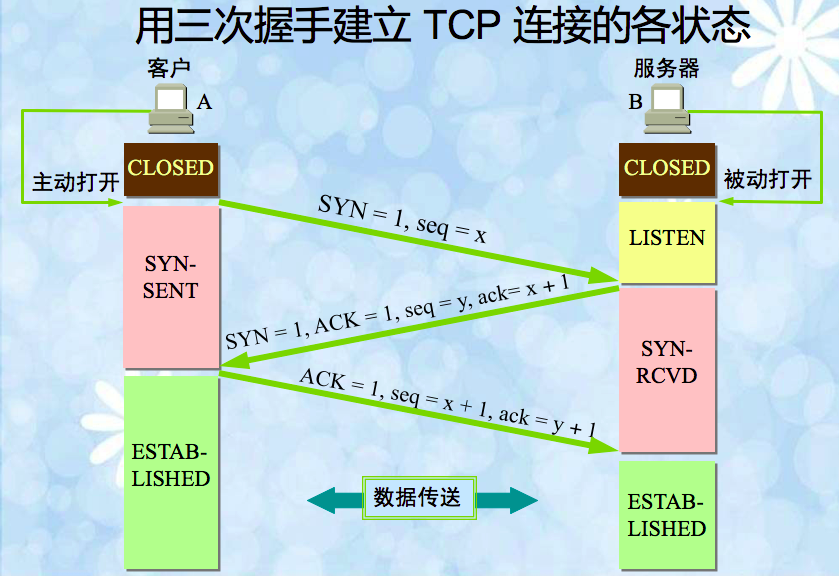
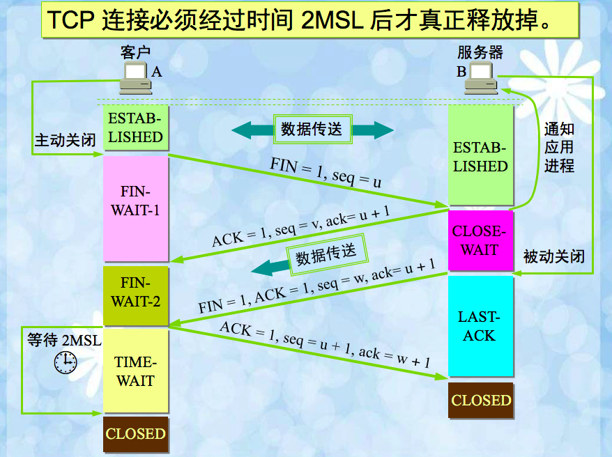

#TCP 三次握手 四次挥手
##具体的流程

- tcp标志位：有6种标示:SYN(synchronous建立联机)、 ACK(acknowledgement 确认) 、PSH(push传送、ST(reset重置)、 URG(urgent紧急) 、Sequence number(顺序号码) Acknowledge number(确认号码)。
- 握手过程中传送的包里不包含数据，三次握手完毕后，客户端与服务器才正式开始传送数据。理想状态下，TCP连接一旦建立，在通信双方中的任何一方主动关闭连接之前，TCP 连接都将被一直保持下去。
- 挥手：
第一次挥手：主动关闭方发送一个FIN，用来关闭主动方到被动关闭方的数据传送，也就是主动关闭方告诉被动关闭方：我已经不 会再给你发数据了(当然，在fin包之前发送出去的数据，如果没有收到对应的ack确认报文，主动关闭方依然会重发这些数据)，但是，此时主动关闭方还可 以接受数据。
第二次挥手：被动关闭方收到FIN包后，发送一个ACK给对方，确认序号为收到序号+1（与SYN相同，一个FIN占用一个序号）。
第三次挥手：被动关闭方发送一个FIN，用来关闭被动关闭方到主动关闭方的数据传送，也就是告诉主动关闭方，我的数据也发送完了，不会再给你发数据了。
第四次挥手：主动关闭方收到FIN后，发送一个ACK给被动关闭方，确认序号为收到序号+1，至此，完成四次挥手。
- 为何使用三次握手机制：
假设如下异常情况：
客户端向服务器发送了第一条请求报文，但是该报文并未在网络中被丢弃，而是长时间阻滞在某处，而客户端收不到服务器确认，以为该报文丢失，于是重新发送该报文，这次的报文成功到达服务器，如果不使用三次握手，则服务器只需对该报文发出确认，就建立了一个连接。而在这个连接建立，并释放后，第一次发送的，阻滞在网络中的报文到达了服务器，服务器以为是客户端又重新发送了一个连接请求（实际上在客户端那里，该连接早已失效），就又向客户端发送一个确认，但客户端认为他没有发送该请求报文，因此不理睬服务器发送的确认，而服务器以为又建立了一个新的连接，于是一直等待A发来数据，造成了服务器资源的浪费，并且会产生安全隐患。因此，若使用三次握手机制，服务器发送了该确认后，收不到客户端的确认，也就知道并没有建立连接，因此不会将资源浪费在这种没有意义的等待上。
- 为什么建立连接协议是三次握手，而关闭连接却是四次挥手呢？ 
   这是因为服务端的LISTEN状态下的SOCKET当收到SYN报文的建连请求后，它可以把ACK和SYN（ACK起应答用，而SYN起同步作用）在一个报文里来发送。但关闭连接时，当收到对方的FIN报文通知时，它仅仅表示对方没有数据发送给你了；但未必你所有的数据全部发送给对方了，所以你可以未必会马上会关闭SOCKET,也即你可能还需要发送一些数据给对方之后，再发送FIN报文给对方来表示你同意现在可这里的ACK报文和FIN报文多数情况下都是分开发送的.
   - 为什么TIME_WAIT状态还需要等2MSL后才能返回到CLOSED状态？ 
   这是因为虽然双方都同意关闭连接了，而且握手的4个报文也都协调和发送完毕，按理可以直接回到CLOSED状态（就好比STABLISH状态那样）；但是因为我们必须要假想网络是不可靠的，你无法保证你最后发送的ACK报文会一定被对方收到，因状态下的SOCKET可能会因为超时未收到ACK报文，而重发FIN报文，所以这个TIME_WAIT状态的作用就是用来重发可能丢失的ACK报文。
   - 如果已经建立了连接，但是客户端突然出现故障了怎么办？
   TCP还设有一个保活计时器，显然，客户端如果出现故障，服务器不能一直等下去，白白浪费资源。服务器每收到一次客户端的请求后都会重新复位这个计时器，时间通常是设置为2小时，若两小时还没有收到客户端的任何数据，服务器就会发送一个探测报文段，以后每隔75分钟发送一次。若一连发送10个探测报文仍然没反应，服务器就认为客户端出了故障，接着就关闭连接。