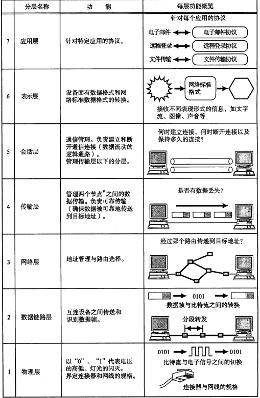
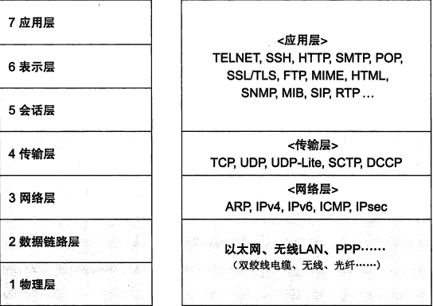

##OSI七层模型


- 物理层：利用传输戒指为通信主机之间建立，管理和释放物理连接，实现比特流的传输，为数据链路层提供数据传输服务
传输单元是比特
- 数据链路层：通过建立数据链路连接，采用差错控制与流量控制方法，使有差错的物理线路变成无差错的数据链路
传输单元是帧
- 网络层：通过路由选择算法为分组通过通信子网选择适当的传输路径，实现流量控制，拥塞控制和网络互联的功能
传输单元是分组
- 传输层：为分布在不同地理位置计算机的进程通信提供可靠的端到端连接与数据传输服务。网络中的socket：ip地址：端口号
传输单元是报文
- 会话层：负责维护两个会话主机之间连接的建立，管理和终止，以及数据的交换
传输单元是段
- 表示层：负责通信系统之间的数据格式交换，数据加密与解密，数据压缩与恢复
- 应用层：实现协同工作的应用程序之间的通信过程控制
##TCP/IP参考模型

最底层为主机网络层
```
##TCP和UDP
UDP：
DNS(53)		DHCP(67/68)		TFTP(69)		SNMP(161/162		)RIP(520)
TCP:
FTP(文件20/21数据连接，控制连接)		TELNET(23) 	SMTP(25)		HTTP(80)
```
-全网唯一标识：协议，本地地址，本地端口号
###UDP
- UDP特性：在传输报文时不需要在通信双方简历连接，减少了协议开销与传输延迟
- UDP除了提供一种可选的校验和外，几乎没有提供其他的保证数据传输可靠性的措施
- 如果检测出收到的分组出错，就丢弃这个分组，既不确认，也不它哦你通知发送端要求重传
-尽力而为的传输服务
###TCP
- 特点：
	- 支持面向连接的传输
	- 支持字节流传输
	- 支持全双工
	- 可靠性：序列号，应答机制，定时器
	- 流量控制
	- 拥塞控制
###三次握手和四次挥手

###快速排序
```
public class QuickSort {
    public static void sort(int a[],int low,int hight){
        int i,j,index;
        if(low>hight){
            return;
        }
        i = low;
        j = hight;
        index = a[i];//用子表的第一个记录做基准
        while(i<j){//从表的两端交替向中间扫描
            while(i<j&&a[j]>=index)
                j--;
            if(i<j)
                a[i++] = a[j];//用比基准小的记录替换低位记录
            while(i<j&&a[i]<index)
                i++;
            if(i<j)
                a[j--]=a[i];//用比基准大的记录替换高位记录
        }
        a[i]=index;
        sort(a,low,i-1);//低子表进行递归排序
        sort(a,i+1,hight);//高子表进行递归排序
    }
    public static void quicksort(int a[]){
        sort(a,0,a.length-1);
    }
}

```
##找出第k大
```
public class nk {
    public static void sort(int a[],int low,int hight,int k){
        int i,j,index;
        if(low>hight){
            return;
        }
        i = low;
        j = hight;
        index = a[i];//用子表的第一个记录做基准
        while(i<j){//从表的两端交替向中间扫描
            while(i<j&&a[j]>=index)
                j--;
            if(i<j)
                a[i++] = a[j];//用比基准小的记录替换低位记录
            while(i<j&&a[i]<index)
                i++;
            if(i<j)
                a[j--]=a[i];//用比基准大的记录替换高位记录
        }
        a[i]=index;
        //if(i-low+1==k) return;
        if(i-low+1>k) sort(a,low,i-1,k);//低子表进行递归排序
        if(i-low+1<k) sort(a,i+1,hight,k-(k-i+1));//高子表进行递归排序
    }
}

```
##Linux 命令
```
ls -a 列出目录下所有的文件，包括.隐藏文件 
ls -i test.c 	输出文件的inode编号
ls -l test.c 	列出文件的详细信息
cd 切换目录  cd .. 返回上级	cd ~返回用户主工作目录	cd - 返回最近返回的目录
mkdir创建目录
cp 文件1 文件2 ... 目的路径
rmdir -p -v 目录名称 
-p 表示当子目录被删除后，父目录为空，也一并删除
-v 每次删除的时候显示删除的信息
mv 源文件 目的文件
ps -a 全部进程
ps -a | grep 正则表达式
find ：列出当前目录
find 文件名：找出文件
find *.后缀名
kill pid
tar
cat 查看文本文件内容
vi 使用文本编辑器查看
sort
```
##粘包和拆包  长度+数据类型+数据
##
```
public class Search {
    public static int biSearch(int arr[],int a) {
        int low=0;
        int high=arr.length-1;
        int mid;
        while (low<=high){
            mid=(low+high)/2;
            if(arr[mid]==a){
                return mid+1;
            }
            else if(arr[mid]<a){
                low=mid+1;
            }
            else {
                high=mid-1;
            }
        }
        return -1;
    }
}

```
##变形的二分法，查找第一个大于a的数
```
public class QuickSort {
    public static int biSearch(int arr[],int a) { 
        int low=0;
        int high=arr.length-1;
        int mid;
        while (low<high){
           mid = (low+high)/2;
           if(arr[mid]>a) high=mid-1;
           else low = mid + 1;
        }
        return low;
    }
}
```
